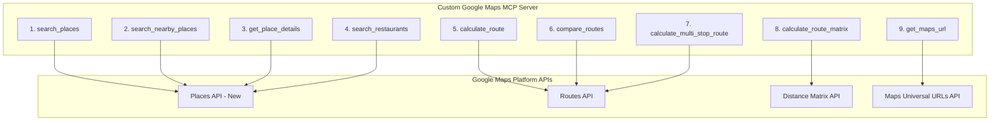
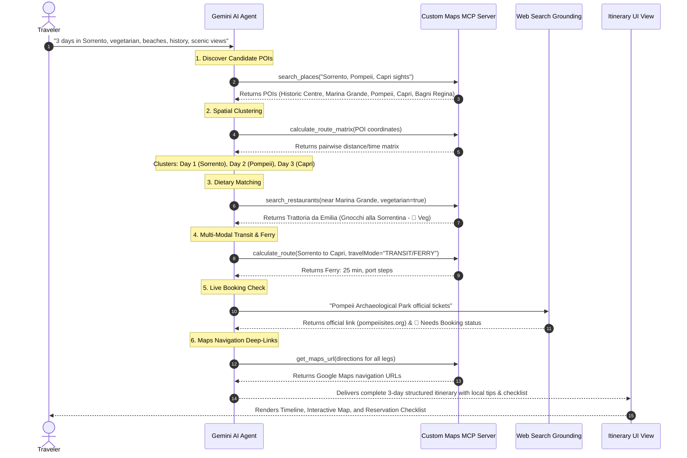

# Italy Local Travel Planner — Architecture Plan & Maps MCP Specification

> **Document Version:** 2.0.0  
> **Status:** Approved / Core MCP & Agent Architecture Plan  
> **System Stack:** Gemini AI Agent (AI Studio / Gemini SDK) · Custom Google Maps MCP Server · Google Search Grounding  
> **Referenced Document:** [problemstatement.md2](problemstatement.md2)  

---

## 1. System Topology & Architectural Overview

The **Italy Local Travel Planner** is powered by a simplified, high-leverage agentic architecture. The **Gemini AI Agent** sits at the center as the intelligent planner and conversational guide, connected to two specialized tool providers:
1. **Custom Google Maps MCP Server:** A dedicated Model Context Protocol (MCP) server that exposes exactly **9 deterministic geospatial, routing, and places tools** backed by Google Maps Platform APIs (Places API, Routes API, Distance Matrix API).
2. **Native Gemini Web Search Grounding:** Built-in live search capability for real-time ticket availability, operating hours, and official booking URLs.

```
                    GEMINI AI AGENT
               (Google AI Studio / SDK)
                          │
             ┌────────────┴────────────┐
             │                         │
      Gemini Web Search          YOUR MAPS MCP
    (Live bookings/hours)       (Custom Server)
                                       │
                                       ▼
                                Google Maps APIs
                                       │
                            ┌──────────┼──────────┐
                            ▼          ▼          ▼
                         Places      Routes    Maps URLs
```

### 1.1 Separation of Concerns

| Architectural Layer | Core Responsibility | Technologies Used |
| :--- | :--- | :--- |
| **Agent Reasoning Layer** | User intent parsing, destination ranking, day-load pacing, conversational trip mutation, and itinerary synthesis. | Google Gemini 2.0 Flash / 1.5 Pro |
| **Geospatial Ground Truth** | Deterministic place coordinates, ratings, multi-modal routing, transit times, and TSP clustering. | Custom Google Maps MCP Server (`stdio`/`sse`) |
| **Live Verification Layer** | Live ticket booking requirements, seasonal closures, strike notices, and official booking authority links. | Gemini Web Search Grounding / Search Tool |
| **Client UI / View Layer** | Minimalist 5-tab interface: Home, Explore, Timeline, Interactive Map, Food Discovery, and Checklist. | Next.js 15 / React 19 / Tailwind CSS / Zustand |

---

## 2. Technical Specification of the 9 Custom Maps MCP Tools

The Custom Maps MCP Server exposes strictly **9 dedicated tools**. Below is the complete specification for each tool including input schemas, output payloads, and underlying Google Maps API mappings.



---

### 2.1 Tool 1: `search_places`
* **Purpose:** Text-based search for attractions, beaches, museums, historical monuments, shopping areas, viewpoints, and points of interest.
* **Underlying API:** Google Maps Places API (New) — `TextSearch` (`https://places.googleapis.com/v1/places:searchText`).
* **Input Schema:**
```typescript
interface SearchPlacesInput {
  query: string;               // e.g. "top historical attractions in Rome", "scenic beaches in Sorrento"
  cityOrRegion?: string;       // e.g. "Rome", "Puglia", "Lake Garda"
  category?: string;           // "historical" | "museums" | "beaches" | "shopping" | "viewpoints" | "churches" | "must_visit"
  limit?: number;              // Default: 10, Max: 20
}
```
* **Output Payload:**
```typescript
interface SearchPlacesOutput {
  places: Array<{
    placeId: string;
    name: string;
    address: string;
    coordinates: { lat: number; lng: number };
    rating: number;
    userRatingCount: number;
    types: string[];
    priceLevel?: string;
  }>;
}
```

---

### 2.2 Tool 2: `search_nearby_places`
* **Purpose:** Find attractions, viewpoints, towns, and amenities surrounding a specific coordinate or location within a defined radius.
* **Underlying API:** Google Maps Places API (New) — `NearbySearch` (`https://places.googleapis.com/v1/places:searchNearby`).
* **Input Schema:**
```typescript
interface SearchNearbyPlacesInput {
  latitude: number;
  longitude: number;
  radiusMeters: number;        // e.g. 5000 (5km) for local, 35000 (35km) for regional excursions
  includedTypes?: string[];    // e.g. ["tourist_attraction", "historical_landmark", "church", "natural_feature"]
  minRating?: number;          // Default: 4.0
  limit?: number;              // Default: 10
}
```
* **Output Payload:**
```typescript
interface SearchNearbyPlacesOutput {
  nearbyPlaces: Array<{
    placeId: string;
    name: string;
    distanceMeters: number;
    coordinates: { lat: number; lng: number };
    rating: number;
    types: string[];
  }>;
}
```

---

### 2.3 Tool 3: `get_place_details`
* **Purpose:** Retrieves exhaustive metadata for a specific place ID including verified hours, contact info, ratings, and Google Maps URL.
* **Underlying API:** Google Maps Places API (New) — `PlaceDetails` (`https://places.googleapis.com/v1/places/{PLACE_ID}`).
* **Input Schema:**
```typescript
interface GetPlaceDetailsInput {
  placeId: string;
}
```
* **Output Payload:**
```typescript
interface GetPlaceDetailsOutput {
  placeId: string;
  name: string;
  formattedAddress: string;
  coordinates: { lat: number; lng: number };
  rating: number;
  userRatingCount: number;
  websiteUri?: string;
  googleMapsUri: string;
  regularOpeningHours?: {
    openNow: boolean;
    weekdayDescriptions: string[]; // e.g. ["Monday: 9:00 AM – 7:00 PM", ...]
  };
  types: string[];
}
```

---

### 2.4 Tool 4: `search_restaurants`
* **Purpose:** Contextual restaurant search near a POI or coordinate with cuisine filtering, strict vegetarian / non-vegetarian criteria, price tiers, and ratings.
* **Underlying API:** Google Maps Places API (New) — `NearbySearch` & `TextSearch` with dietary keyword weighting.
* **Input Schema:**
```typescript
interface SearchRestaurantsInput {
  latitude: number;
  longitude: number;
  radiusMeters?: number;       // Default: 1000m (walkable radius from attraction)
  cuisine?: string;            // e.g. "Roman", "Campanian", "Seafood", "Trattoria", "Pizzeria"
  dietaryPreference?: "vegetarian" | "non_vegetarian" | "both";
  priceLevels?: Array<"PRICE_LEVEL_INEXPENSIVE" | "PRICE_LEVEL_MODERATE" | "PRICE_LEVEL_EXPENSIVE">;
  minRating?: number;          // Default: 4.2
  limit?: number;              // Default: 5
}
```
* **Output Payload:**
```typescript
interface SearchRestaurantsOutput {
  restaurants: Array<{
    placeId: string;
    name: string;
    address: string;
    coordinates: { lat: number; lng: number };
    rating: number;
    priceLevel: string;        // "€" | "€€" | "€€€" | "€€€€"
    cuisineType: string[];
    vegetarianFriendly: boolean;
    signatureDishes: string[];
    approxWalkingMinutes: number;
    distanceMeters: number;
    googleMapsUri: string;
  }>;
}
```

---

### 2.5 Tool 5: `calculate_route`
* **Purpose:** Calculates precise turn-by-turn route, distance, and duration between Point A and Point B for a specified travel mode.
* **Underlying API:** Google Maps Routes API — `computeRoutes` (`https://routes.googleapis.com/directions/v2:computeRoutes`).
* **Input Schema:**
```typescript
interface CalculateRouteInput {
  origin: { lat: number; lng: number } | string;       // Coordinates or Place ID / Address
  destination: { lat: number; lng: number } | string;
  travelMode: "WALK" | "DRIVE" | "TRANSIT" | "BICYCLE";
  transitPreferences?: {
    routingPreference?: "LESS_WALKING" | "FEWER_TRANSFERS";
    allowedModes?: Array<"BUS" | "SUBWAY" | "TRAIN" | "FERRY">;
  };
}
```
* **Output Payload:**
```typescript
interface CalculateRouteOutput {
  origin: string;
  destination: string;
  travelMode: string;
  distanceMeters: number;
  durationSeconds: number;
  durationFormatted: string;   // e.g. "8 mins", "35 mins"
  transitSteps?: Array<{
    instruction: string;       // e.g. "Take Line B Metro towards Laurentina (3 stops)"
    durationSeconds: number;
    travelMode: string;
  }>;
  polylineEncoded?: string;
  googleMapsNavigationUrl: string;
}
```

---

### 2.6 Tool 6: `compare_routes`
* **Purpose:** Concurrently computes and compares available travel modes (walking vs. transit vs. driving vs. ferry) between two points to select the optimal transport method.
* **Underlying API:** Google Maps Routes API — Parallel `computeRoutes` execution.
* **Input Schema:**
```typescript
interface CompareRoutesInput {
  origin: { lat: number; lng: number } | string;
  destination: { lat: number; lng: number } | string;
}
```
* **Output Payload:**
```typescript
interface CompareRoutesOutput {
  origin: string;
  destination: string;
  recommendedMode: "WALK" | "TRANSIT" | "DRIVE" | "FERRY";
  recommendationReason: string; // e.g. "Walking is 8 min (faster than waiting for transit)" or "Ferry is required (25 min)"
  modes: {
    walking?: { distanceMeters: number; durationMinutes: number; feasible: boolean };
    transit?: { distanceMeters: number; durationMinutes: number; lines: string[] };
    driving?: { distanceMeters: number; durationMinutes: number; ztlWarning?: boolean };
    ferry?:   { durationMinutes: number; departurePort?: string };
  };
}
```

---

### 2.7 Tool 7: `calculate_multi_stop_route`
* **Purpose:** Calculates the complete sequence of an entire day (`Hotel -> Attraction A -> Restaurant -> Attraction B -> Hotel`), returning individual leg metrics, total distance, and total travel time to evaluate day load and fatigue.
* **Underlying API:** Google Maps Routes API with intermediate waypoints.
* **Input Schema:**
```typescript
interface CalculateMultiStopRouteInput {
  originHotel: { lat: number; lng: number } | string;
  stops: Array<{
    name: string;
    location: { lat: number; lng: number } | string;
    type: "attraction" | "restaurant" | "viewpoint";
    allocatedDwellMinutes: number; // e.g. 90 min at Colosseum, 60 min for lunch
  }>;
  returnToHotel?: boolean;     // Default: true
  travelMode?: "WALK" | "TRANSIT" | "DRIVE";
}
```
* **Output Payload:**
```typescript
interface CalculateMultiStopRouteOutput {
  totalTravelDurationMinutes: number;
  totalActivityDurationMinutes: number;
  totalDayDurationMinutes: number;
  totalWalkingDistanceKm: number;
  dayEfficiencyStatus: "comfortable" | "busy" | "overloaded";
  legs: Array<{
    from: string;
    to: string;
    distanceMeters: number;
    durationMinutes: number;
    mode: string;
    instructions: string;
    googleMapsUrl: string;
  }>;
}
```

---

### 2.8 Tool 8: `calculate_route_matrix`
* **Purpose:** Computes a full pairwise distance and duration matrix for $M 	imes N$ candidate places to group attractions into optimal geographic clusters and solve the Traveling Salesperson Problem (TSP).
* **Underlying API:** Google Maps Routes API — `computeRouteMatrix` (`https://routes.googleapis.com/distanceMatrix/v2:computeRouteMatrix`).
* **Input Schema:**
```typescript
interface CalculateRouteMatrixInput {
  placeCoordinates: Array<{ id: string; lat: number; lng: number }>;
  travelMode: "WALK" | "DRIVE" | "TRANSIT";
}
```
* **Output Payload:**
```typescript
interface CalculateRouteMatrixOutput {
  matrix: Array<{
    originId: string;
    destinationId: string;
    distanceMeters: number;
    durationSeconds: number;
    status: "SUCCESS" | "ROUTE_NOT_FOUND";
  }>;
}
```

---

### 2.9 Tool 9: `get_maps_url`
* **Purpose:** Generates official Universal Google Maps URLs for single places, multi-point routes, and turn-by-turn navigation deep-links.
* **Underlying Logic:** Google Maps Universal URLs format generator.
* **Input Schema:**
```typescript
interface GetMapsUrlInput {
  action: "search" | "place" | "directions";
  queryOrPlaceName?: string;
  placeId?: string;
  origin?: string;             // Address or "lat,lng"
  destination?: string;
  waypoints?: string[];        // Array of intermediate stops for multi-leg directions
  travelMode?: "walking" | "transit" | "driving" | "bicycling";
}
```
* **Output Payload:**
```typescript
interface GetMapsUrlOutput {
  url: string;                 // e.g. "https://www.google.com/maps/dir/?api=1&origin=...&destination=...&travelmode=walking"
}
```

---

## 3. MCP Server Implementation Architecture

The Custom Maps MCP Server is implemented as a lightweight, modular service using the standard Model Context Protocol SDK.

### 3.1 Server Architecture Directory Tree
```text
maps-mcp-server/
├── package.json                       # Dependencies: @modelcontextprotocol/sdk, axios, dotenv
├── tsconfig.json                      # TypeScript configuration
├── src/
│   ├── index.ts                       # MCP Server initialization & Stdio/SSE transport
│   ├── config.ts                      # GOOGLE_MAPS_SERVER_API_KEY & environment validation
│   ├── tools/
│   │   ├── searchPlaces.ts            # Tool 1 implementation
│   │   ├── searchNearbyPlaces.ts      # Tool 2 implementation
│   │   ├── getPlaceDetails.ts         # Tool 3 implementation
│   │   ├── searchRestaurants.ts       # Tool 4 implementation
│   │   ├── calculateRoute.ts          # Tool 5 implementation
│   │   ├── compareRoutes.ts           # Tool 6 implementation
│   │   ├── calculateMultiStopRoute.ts # Tool 7 implementation
│   │   ├── calculateRouteMatrix.ts    # Tool 8 implementation
│   │   └── getMapsUrl.ts              # Tool 9 implementation
│   ├── services/
│   │   ├── googlePlacesClient.ts      # Places API v1 (New) Axios wrapper
│   │   ├── googleRoutesClient.ts      # Routes API v2 Axios wrapper
│   │   └── cacheService.ts            # In-memory LRU / Redis cache
│   └── types/
│       └── maps.ts                    # Google Maps API types & MCP schemas
└── build/                             # Compiled JavaScript bundle
```

### 3.2 MCP Server Tool Registration
The server registers all 9 tools and exposes them over `stdio` transport for direct connection in AI Studio or the agent runtime environment.

---

## 4. Gemini AI Agent Configuration & Tool Orchestration

### 4.1 AI Studio & Gemini SDK Agent Setup
In Google AI Studio or your Next.js backend, Gemini is configured with access to:
1. **Google Search Grounding (Native Gemini Tool):** For real-time ticket availability, strikes, opening hours, and official booking URLs.
2. **Custom Maps MCP Server (The 9 Tools):** For spatial clustering, place discovery, multi-modal routing, and travel-time calculations.

### 4.2 System Instruction / Agent Persona
The agent prompt enforces the 10 Core AI Directives: ground truth routing via Maps MCP, zero fabrication, geographic clustering via route matrices, authentic vegetarian dish validation, official ticketing verification via search, and max 9-hour active day loads.

---

## 5. End-to-End Execution Trace: Sorrento 3-Day Example



---

## 6. Resilience, Caching & Cost Optimization

### 6.1 Caching Strategy
* **Places Metadata & Coordinates:** Cached in-memory / Redis for **30 days** (`placeId` is static).
* **Pairwise Distance Matrices:** Cached for **24 hours** keyed by `(originId, destinationId, travelMode)`.
* **Search Grounding Results:** Cached for **7 days** with automatic invalidation on trip edits.

### 6.2 Error Handling & Fallbacks
* **Unreachable Ferry / Routes API Error:** The MCP tool returns fallback walking/bus bounds with a clear notification: *"Transit calculated via offline estimate (ferry status subject to sea conditions)."*
* **Search Timeout (>2.5s):** Agent gracefully displays verified static database guidelines and appends *"Live verification pending. Please verify on site."*

---

## 7. Architecture Plan Summary & Delivery Checklist

| Component | Status | Implementation Target |
| :--- | :---: | :--- |
| **Custom Maps MCP Server (9 Tools)** | Defined | TypeScript `@modelcontextprotocol/sdk` on `stdio` / `sse` |
| **Gemini AI Agent Setup** | Defined | Google AI Studio with System Instruction & Tool Binding |
| **Web Search Grounding** | Defined | Built-in Gemini search tool for ticket verification |
| **Next.js 15 UI Client** | Defined | 5 interactive tabs (Explore, Plan, Map, Food, Checklist) |
