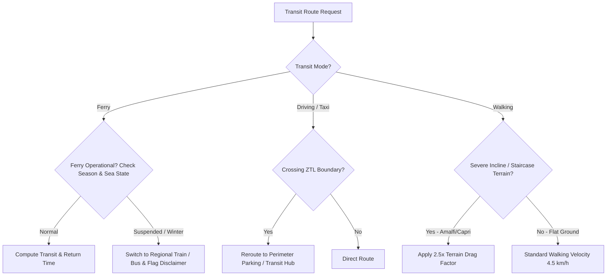
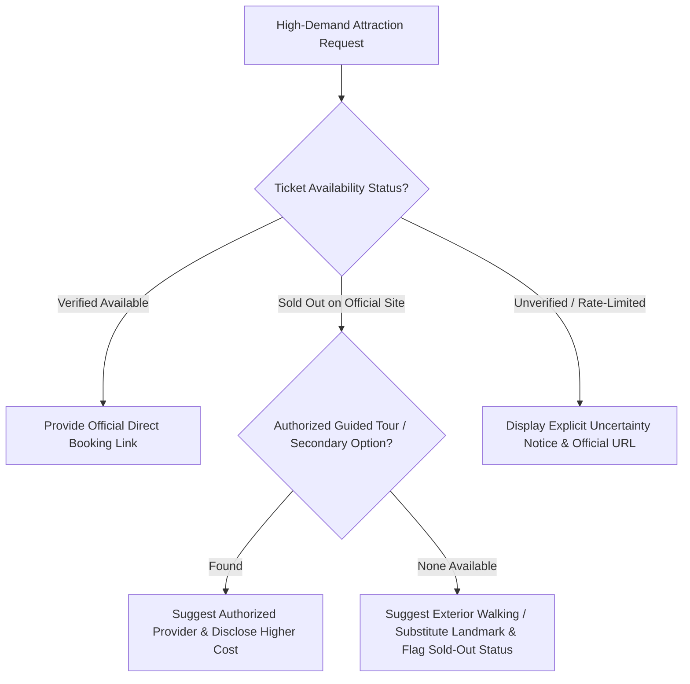
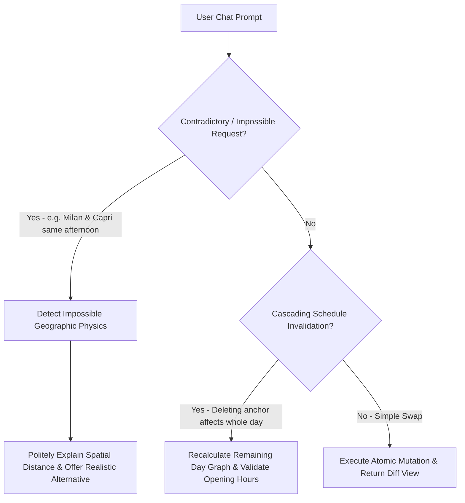
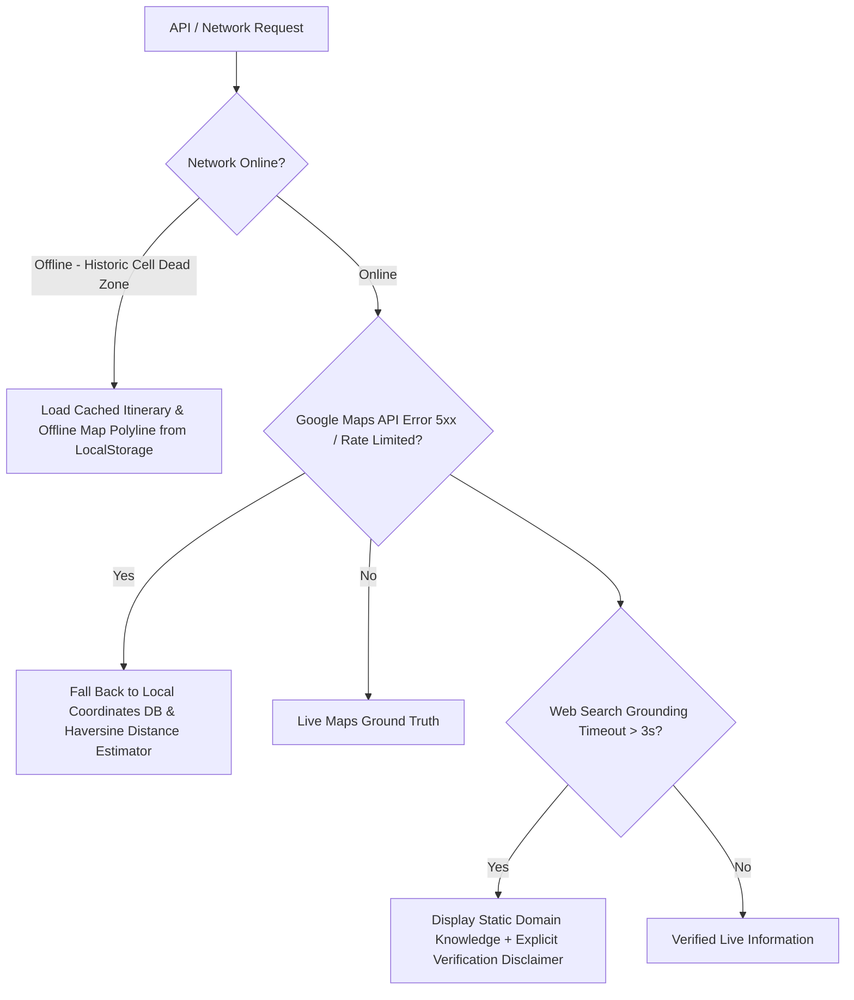

# Italy Local Travel Planner — Edge Case & Corner Scenario Engineering Manual

> **Document Version:** 1.0.0  
> **Status:** Approved / Core Engineering Resilience Specification  
> **Referenced Blueprints:** [architecture.md](architecture.md) · [problemstatement.md](problemstatement.md) · [implementation-plan.md](implementation-plan.md)  

---

## 1. Executive Overview & Resilience Philosophy

In travel planning systems, real-world execution failures happen not at the happy path, but at the boundary conditions: ferry cancellations due to choppy seas, Italian rail strikes, midday restaurant kitchen closures, sold-out monument passes, and hidden meat broths in traditional pastas.

The **Italy Local Travel Planner** enforces a resilient system design that prioritizes:
1. **Deterministic Fallbacks over Uncontrolled Hallucination**
2. **Explicit Uncertainty Disclaimers over Fabricated Logistics**
3. **Domain-Specific Italian Ground Truth over Generic Global Heuristics**
4. **Graceful Degradation when APIs, Networks, or Verification Layers Fail**

---

## 2. Category 1: Geographic & Multi-Modal Transit Edge Cases



### 2.1 Sea & Ferry Transit Disruptions (Amalfi Coast, Capri, Lake Garda)
* **Scenario:** User plans a ferry from Sorrento to Capri or Positano, but services are cancelled due to adverse sea conditions (*Mare Mosso*) or seasonal winter shutdown (November to March).
* **Detection Mechanism:** Web search grounding detects weather/sea warning or ferry operator winter timetable notice.
* **Mitigation / Fallback:**
  * If summer sea warning: System flags warning and offers Circumvesuviana train alternatives to Pompeii/Herculaneum or inland Sorrento activities.
  * If winter trip: System automatically hides ferry transport and routes via regional buses (SITA SUD) or trains.
* **User-Facing Alert:**
  > [!WARNING]
  > **Maritime Advisory:** *Ferries between Sorrento and Capri/Amalfi Coast frequently suspend service during rough sea conditions and operate on reduced winter schedules (Nov–Mar). Verify departure status at the port ticket counter before leaving your hotel.*

### 2.2 Limited Traffic Zones (ZTL - *Zona a Traffico Limitato*)
* **Scenario:** User selects "driving/car" in historic centers (Rome Centro Storico, Milan Area C, Florence, Bari Vecchia) where unauthorized vehicles receive heavy automated fines.
* **Detection Mechanism:** Destination coordinates cross ZTL boundary polygon.
* **Mitigation / Fallback:**
  * System overrides direct door-to-door driving directions, routes the vehicle to the nearest secure perimeter parking garage (e.g. *Parcheggio Villa Borghese* in Rome), and generates walking/metro legs from the garage to the destination.
* **User-Facing Alert:**
  > [!IMPORTANT]
  > **ZTL Driving Restriction:** *This destination is inside the restricted Zona a Traffico Limitato (ZTL). Non-resident cars will be fined. We have routed your car to the nearest perimeter parking garage with a short walk/metro connection.*

### 2.3 Topographical Elevation & Vertical Staircases (Positano, Sorrento Marina, Capri)
* **Scenario:** Google Maps indicates a direct 600m walk between Sorrento cliff center and Marina Grande, but fails to account for 200 vertical stone steps, leading to extreme user fatigue or accessibility failures.
* **Detection Mechanism:** Geospatial elevation delta lookup between origin and destination nodes.
* **Mitigation / Fallback:**
  * System applies a **2.5x terrain drag coefficient** on walking durations for steep coastal routes.
  * System proactively offers the public elevator (*Ascensore di Sorrento*) or municipal shuttle bus option for travelers with low walking tolerance.

### 2.4 Italian Public Transit Strikes (*Sciopero dei Trasporti*)
* **Scenario:** Regional or national transport strike announced affecting Trenitalia, Italo, ATAC Rome, or ANM Naples.
* **Detection Mechanism:** Web verification search queries Italian Ministry of Infrastructure (*mit.gov.it*) or transport operator strike bulletins.
* **Mitigation / Fallback:**
  * Flags guaranteed minimum service windows (*Fasce di Garanzia*: usually 06:00–09:00 and 18:00–21:00) and reorganizes critical intercity transfers into guaranteed morning slots.
* **User-Facing Alert:**
  > [!CAUTION]
  > **Transit Strike Notice (*Sciopero*):** *A scheduled transport strike may affect local buses/trains today. Italian law guarantees service during mandatory windows (06:00–09:00 and 18:00–21:00). We have shifted your long-distance transfer to 07:30.*

---

## 3. Category 2: Opening Hours, Closures & Calendar Quirks

### 3.1 Weekly Institutional Closures (Monday / Sunday Rules)
* **Scenario:** User builds a 2-day Rome trip covering Sunday and Monday, attempting to schedule the Vatican Museums on Sunday and Galleria Borghese on Monday.
* **Ground Truth Rule:**
  * Vatican Museums: **Closed every Sunday** (except the last Sunday of each month).
  * Galleria Borghese & Uffizi & many state museums: **Closed every Monday**.
* **Detection Mechanism:** Calendar day mapping in `openingHours.isClosedOn` array during itinerary synthesis.
* **Mitigation / Fallback:**
  * System automatically schedules Vatican Museums on Saturday or Monday, and schedules Borghese Gallery on Sunday or Tuesday. If conflicting with user trip dates, it replaces the closed museum with open outdoor landmarks (Colosseum/Piazza Navona/Pantheon) and notifies the user.
* **User-Facing Alert:**
  > [!NOTE]
  > **Schedule Adjustment:** *The Vatican Museums are closed on Sundays, and Galleria Borghese is closed on Mondays. We have automatically placed the Vatican on your open day and scheduled open historical piazzas for Sunday.*

### 3.2 Midday Italian Afternoon Closure (*Riposo Pomeridiano*)
* **Scenario:** User attempts to schedule shopping at local boutiques or visits to historic neighborhood churches in Bari or Puglia towns (Ostuni/Alberobello) between 13:30 and 16:30.
* **Ground Truth Rule:** Southern Italian local businesses, smaller churches, and neighborhood markets close daily between 13:30 and 16:30 for the traditional afternoon break (*riposo*).
* **Mitigation / Fallback:**
  * System allocates 13:00–15:00 strictly for leisurely sit-down lunch and shade rest; schedules indoor major monuments (which stay open continuously) or seaside walks during midday, and shifts shopping to 17:00–20:00 when Italian evenings (*passeggiata*) are lively.

### 3.3 Italian National Holidays (*Giorni Festivi*)
* **Scenario:** User travels during major Italian holidays:
  * **Ferragosto (August 15th):** Almost all local shops and family trattorias shut down; public transit runs on severe holiday schedules.
  * **Pasqua & Pasquetta (Easter Sunday & Easter Monday):** High tourist congestion and abnormal museum hours.
  * **Capodanno (January 1st) & Natale (December 25th):** Widespread closures.
* **Detection Mechanism:** Holiday date lookup against Italian calendar registry.
* **Mitigation / Fallback:**
  * Itinerary flags open state monuments (e.g. Colosseum usually open on Easter Monday), warns against relying on spontaneous trattoria walk-ins, and generates mandatory dinner reservation reminders.

---

## 4. Category 3: Ticketing, Booking & Sold-Out Monument Scenarios



### 4.1 Mandatory Timed-Entry Sights Sold Out (e.g., Leonardo’s *Last Supper*, Vatican, Colosseum)
* **Scenario:** A traveler books a trip to Milan 3 days in advance and requests Leonardo da Vinci’s *The Last Supper* (*Cenacolo Vinciano*), which typically sells out 60–90 days in advance.
* **Detection Mechanism:** Booking lead time $<30\text{ days}$ and web search verifies official tickets are sold out.
* **Mitigation / Fallback:**
  1. System flags that official individual tickets are sold out.
  2. Proactively checks reputable authorized secondary guided options (e.g., official combo passes with Pinacoteca di Brera).
  3. Proactively recommends high-yield cultural substitutes (e.g., *Pinacoteca di Brera*, *Castello Sforzesco*, or *San Maurizio al Monastero Maggiore*—the "Sistine Chapel of Milan").
* **User-Facing Alert:**
  > [!WARNING]
  > **Sold Out Alert:** *Official advance tickets for The Last Supper are fully booked for your dates. We have substituted the nearby Pinacoteca di Brera and San Maurizio al Monastero Maggiore (both feature Renaissance masterpieces and have walk-in availability).*

### 4.2 Locked User Reservation Anchors
* **Scenario:** Traveler already holds a pre-booked ticket for the Colosseum at 14:00 on Day 2. During conversational editing, the user asks: *"Can we move lunch to Trastevere and add Castel Sant’Angelo?"*
* **Detection Mechanism:** POI tagged with `actionRequired: "Pre-booked ticket entry at 14:00"`.
* **Mitigation / Fallback:**
  * The itinerary optimizer treats 14:00 Colosseum as an **immovable constraint**. It calculates transit from Trastevere to Colosseum and warns if lunch would cause a late arrival, enforcing that the user finishes lunch by 13:15.

### 4.3 Fake / Commercial Reseller Link Prevention
* **Scenario:** Web search yields third-party affiliate aggregators charging €80 for a €18 standard museum ticket.
* **Detection Mechanism:** Provider URL whitelist filter (must match verified domain whitelist: `*.va`, `parcocolosseo.it`, `cenacolovinciano.org`, `coopculture.it`, `vivaticket.com`, `ticketone.it`).
* **Mitigation / Fallback:**
  * Drops unauthorized reseller links; presents only primary ticketing authority links or official tourism portals.

---

## 5. Category 4: Dietary & Culinary Edge Cases

### 5.1 Hidden Non-Vegetarian Ingredients in Classic Italian Cooking
* **Scenario:** A strict vegetarian selects "Vegetarian" and asks for authentic local food in Milan, Rome, and Bari. Generic travel apps recommend *Risotto alla Milanese* or *Orecchiette con Cime di Rapa* without realizing the hidden meat/seafood ingredients.
* **Culinary Domain Ground Truth:**
  * **Risotto alla Milanese:** Traditional recipe requires beef bone marrow broth (*midollo di bue*) and meat stock.
  * **Orecchiette con Cime di Rapa:** Authentic Apulian recipe melts salted anchovies (*alici sott’olio*) into the olive oil base.
  * **Animal Rennet (*Caglio Animale*):** Authentic DOP cheeses (Parmigiano Reggiano, Pecorino Romano, Grana Padano) legally require animal rennet; vegetarian alternatives use microbial/vegetable rennet.
  * **Lard (*Strutto*):** Traditional pastry crusts (*Cannoli*, *Sfogliatella*, *Piadina Romagnola*) frequently use pork lard instead of butter.
* **Mitigation / Fallback:**
  * The Dietary Engine flags dishes with `⚠️ Depends on preparation`.
  * Generates an actionable Italian dining phrase for the traveler:
    > *"Sono vegetariano: questo piatto è cucinato con brodo di carne o acciughe?"* (I am vegetarian: is this dish cooked with meat broth or anchovies?)

```
┌─────────────────────────────────────────────────────────────────────────┐
│                      HIDDEN NON-VEG WARNING TABLE                       │
├────────────────────────────┬─────────────────────┬──────────────────────┤
│ Italian Dish               │ Hidden Ingredient   │ Safe Veg Alternative │
├────────────────────────────┼─────────────────────┼──────────────────────┤
│ Risotto alla Milanese      │ Beef bone marrow    │ Risotto allo Zafferano (Vegetable broth) │
│ Orecchiette Cime di Rapa   │ Dissolved anchovy   │ Request *Senza acciughe* (Without anchovy) │
│ Roman Supplì Classico      │ Beef/pork ragù base │ Supplì al Pomodoro e Mozzarella │
│ Piadina Pugliese/Romagnola │ Pork lard (Strutto) │ Piadina all’Olio Extravergine │
│ Parmigiano / Pecorino      │ Calf rennet (Caglio)│ Fresh Mozzarella / Burrata / Ricotta │
└────────────────────────────┴─────────────────────┴──────────────────────┘
```

### 5.2 Italian Meal Timing & Kitchen Hours (*Orari dei Ristoranti*)
* **Scenario:** A foreign traveler wants to have dinner at 17:30 or 18:00 in Rome or Bari.
* **Ground Truth Rule:** Italian restaurant kitchens are strictly closed between 15:00 and 19:30 (and often until 20:00 or 20:30 in Southern Italy/Puglia). Venues serving hot pasta at 17:30 in tourist zones are almost exclusively microwave tourist traps.
* **Mitigation / Fallback:**
  * If a user requests a 17:30 meal, the system routes them to an authentic Italian *Aperitivo* (cocktail/spritz with complimentary focaccia, olives, and bites) or traditional *Enoteca* (wine bar with cold cuts and cheese boards), scheduling proper sit-down dinner at 20:00.

### 5.3 Tourist Trap Detection Heuristics
* **Scenario:** AI searches restaurants near the Colosseum or Duomo di Milano and risks recommending an overpriced tourist trap.
* **Rejection Criteria:**
  * Venues displaying oversized picture menus in outdoor easels.
  * Venues situated directly adjacent to monument exits with aggressive street hawkers.
  * Menus translated into $>6$ languages with generic non-regional food (e.g. serving Hawaiian pizza and Bolognese in Venice).
* **Mitigation:**
  * Enforces minimum 2-block radius offset from major monument gates into local residential side-streets (*vicoli*).

---

## 6. Category 5: Conversational AI & State Mutation Edge Cases



### 6.1 Impossible Multi-City / High-Speed Travel Requests
* **Scenario:** User prompts: *"Add a quick afternoon shopping trip to Milan on Day 2 of my Amalfi Coast trip."*
* **Detection Mechanism:** Origin-to-destination transit distance $>400\text{ km}$ requiring $>4.5\text{ hours}$ one-way transit.
* **Mitigation / Fallback:**
  * LangChain Conversational Agent detects spatial impossibility and politely explains the physical constraint:
  > *"Milan is over 800 km north of Amalfi (approx. 5.5 hours each way by high-speed train). Instead of Milan, we can add high-end artisanal shopping in Capri town or Sorrento’s Corso Italia for Day 2."*

### 6.2 Cascading Schedule Invalidation & Broken Route Chains
* **Scenario:** Traveler deletes the midday museum from a 4-stop sequence, leaving an awkward 2.5-hour gap and a broken walking route from Stop 1 to Stop 3.
* **Mitigation:**
  * LangGraph engine re-runs the `cluster_routes_node` for the remaining nodes, recalculates direct transit from Stop 1 to Stop 3, and fills the time gap with a scenic piazza stroll, gelato pause, or viewpoint visit.

### 6.3 Circular Mutation Loops (User Undoing / Re-requesting)
* **Scenario:** User repeatedly requests *"Make it more packed"* followed by *"Make it less tiring"*.
* **Mitigation:**
  * LangGraph state checkpointer maintains an immutable history of prior daily versions (`Day2_v1`, `Day2_v2`), allowing instant one-tap "Restore previous version" rather than continuously regenerating from scratch.

---

## 7. Category 6: Extreme Weather & Physiological Limitations

### 7.1 Roman / Southern Italian Summer Heatwaves (*Lucifero / Caronte* 38°C–42°C)
* **Scenario:** Traveler visits Rome or Pompeii in July/August during peak midday heat.
* **Ground Truth Rule:** The Roman Forum, Palatine Hill, and Pompeii Archaeological Park offer almost zero shade. Walking for 4 hours under direct Mediterranean sun causes heat exhaustion.
* **Mitigation / Fallback:**
  * System schedules uncovered archaeological ruins strictly between **08:30 and 11:00 AM** or after **17:00 PM**.
  * Inserts air-conditioned museum blocks (e.g. *Palazzo Massimo*, *Vatican Galleries*), shaded churches, and public drinking water fountain stops (*Nasoni* in Rome) between 12:00 and 16:00.

### 7.2 Torrential Rain / Coastal Thunderstorms (*Maltempo*)
* **Scenario:** Heavy rainfall forecasted during outdoor coastal walks (e.g. *Bagni Regina Giovanna* in Sorrento or *Polignano cliffs*).
* **Mitigation / Fallback:**
  * Dynamic day-swap algorithm swaps outdoor cliff days with indoor regional culinary experiences, covered markets (*Mercato Centrale* in Milan), covered art galleries, or historic cathedrals.

### 7.3 Accessibility & Cobblestones (*Sanpietrini*)
* **Scenario:** Traveler selects "Low Walking Tolerance" or travels with elderly family / baby stroller over Rome’s uneven basalt cobblestones (*Sanpietrini*).
* **Mitigation / Fallback:**
  * Caps walking segments to $<350\text{ meters}$, prioritizes electric minibuses (Rome Lines 117/119), avoids steep stone staircases, and routes around pedestrianized cobblestone zones.

---

## 8. Category 7: Network Outages, Offline Failures & API Degradation



### 8.1 Historic Center Cellular Dead Zones
* **Scenario:** Traveler enters thick-walled Roman basilicas, the Colosseum lower arches, or coastal caves where 4G/5G signal drops to zero.
* **Mitigation:**
  * Zustand store with `persist` middleware synchronizes full trip schedules, offline map bounding boxes, restaurant addresses, and checklist data in client `localStorage`. The app remains 100% readable and navigable offline.

### 8.2 Google Maps API Failure / Rate Limiting
* **Scenario:** Google Maps Routes or Places API returns `OVER_QUERY_LIMIT` or 503 Service Unavailable.
* **Mitigation:**
  * System falls back to pre-seeded local coordinates database (`italyKnowledge.ts`), computes transit using cached distance matrix tables and a local Haversine distance heuristic, and appends a clear disclaimer: *"Transit calculated via offline estimate."*

### 8.3 Web Search Grounding Latency Timeout
* **Scenario:** Tavily / Google Search verification tool takes $>3.0\text{ seconds}$ to return live ticket availability.
* **Mitigation:**
  * StateGraph enforces a strict **2.5s timeout per search tool call**. If search times out, the pipeline proceeds with static verified database information and flags the item with: *"Live verification pending. Please confirm on site."*

---

## 9. Master Edge Case Resilience Matrix

| # | Edge Case Domain | Trigger Scenario | Resilience & Fallback Action | User-Facing Notice |
| :-: | :--- | :--- | :--- | :--- |
| **1** | **Maritime Disruptions** | Rough seas / winter ferry cancellations (Capri/Sorrento/Garda) | Automatic route fallback to regional train/bus | ⚠️ *"Ferries subject to sea conditions. Check port desk."* |
| **2** | **Driving Restrictions** | Driving route enters ZTL (Historic Center) | Reroutes vehicle to nearest perimeter garage | 🅿️ *"Routed to perimeter parking outside ZTL zone."* |
| **3** | **Elevation Drag** | Steep cliff staircases (Positano/Sorrento/Capri) | Applies 2.5x time drag; suggests public elevator | 🛗 *"Steep incline: elevator/shuttle alternative available."* |
| **4** | **Transit Strikes** | Public transport strike (*Sciopero*) | Shifts long transfers into mandatory guaranteed windows | 🚆 *"Service guaranteed 06:00–09:00 & 18:00–21:00."* |
| **5** | **Institutional Days** | Vatican on Sun / Borghese & Uffizi on Mon | Swaps closed museum to open day; substitutes piazzas | 🏛 *"Museum closed on this weekday. Rescheduled to open day."* |
| **6** | **Midday Siesta** | Shopping/neighborhood visits 13:30–16:30 | Allocates time to sit-down lunch and rest | ☕ *"Local shops closed for afternoon riposo until 16:30."* |
| **7** | **Sold-Out Sights** | Last Supper / Colosseum pass sold out | Checks combo passes or suggests top Renaissance substitutes | 🎟 *"Sold out: substituted Pinacoteca di Brera + San Maurizio."* |
| **8** | **Locked Anchors** | User has pre-booked timed ticket (10:00 Colosseum) | Freezes time slot as immovable anchor node | 🔒 *"Locked reservation anchor maintained during edits."* |
| **9** | **Hidden Meat/Fish** | Risotto Milanese (bone broth) / Cime di Rapa (anchovy) | Flags with ⚠️; provides Italian waiter query phrase | 🥗 *"Contains traditional meat/fish base. Ask for veg prep."* |
| **10**| **Early Dinner** | Traveler requests dinner at 17:30 | Routes to authentic Italian Aperitivo / Enoteca | 🍷 *"Kitchens open at 19:30. Suggested Aperitivo first."* |
| **11**| **Tourist Traps** | Venues with picture menus outside major gates | Enforces 2-block offset into local residential alleys | 🍝 *"Authentic local trattoria away from tourist crowds."* |
| **12**| **Impossible Prompts**| Requesting Milan shopping on Amalfi Coast day | Explains distance physics and offers local luxury shopping | 📍 *"Milan is 5.5h away. Substituted Capri town boutiques."* |
| **13**| **Summer Heatwaves** | 40°C heat in Rome/Pompeii during July/August | Shifts open ruins to early morning; midday AC museums | ☀️ *"Midday heat warning: scheduled air-conditioned indoor visit."* |
| **14**| **Torrential Rain** | Heavy rain on beach / cliff walk day | Swaps coastal day with covered galleries & food markets | 🌧 *"Rain forecast: switched to covered indoor cultural tour."* |
| **15**| **Offline Dead Zone** | No mobile signal inside thick-walled cathedrals | LocalStorage caches active itinerary & offline maps | 📱 *"Offline mode active. Full schedule & directions available."* |
| **16**| **Search Timeout** | Web search verification takes $>2.5\text{s}$ | Graceful fallback to static database with notice | ℹ️ *"Live verification pending. Please verify on site."* |
