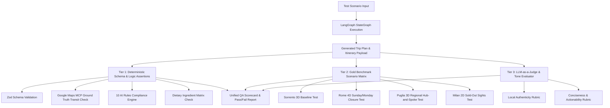

# Italy Local Travel Planner — Evaluation Framework & Quality Assurance Manual

> **Document Version:** 1.0.0  
> **Status:** Approved / Quality Assurance Specification  
> **Target Benchmarks:** Zero Hallucination · $<5.0\text{s}$ Response Latency · $100\%$ Schema Conformity · $100\%$ Rule Adherence  
> **Referenced Blueprints:** [implementation-plan.md](implementation-plan.md) · [architecture.md](architecture.md) · [problemstatement.md](problemstatement.md)  

---

## 1. Evaluation Architecture & QA Philosophy

The **Italy Local Travel Planner** operates under a zero-tolerance policy for logistical hallucinations, false dietary tagging, broken transit routes, and commercial reseller traps. 

The evaluation framework consists of three testing tiers:
1. **Deterministic Assertion Suite:** Code-level unit tests validating TypeScript/Zod schemas, transit durations, coordinate distance matrices, opening hours constraints, and dietary ingredients.
2. **Gold Standard Benchmark Matrix:** 6 real-world multi-day scenarios covering single urban hubs (Rome, Milan), regional multi-town ecosystems (Puglia, Lake Garda), and complex coastal transit hubs (Sorrento/Amalfi).
3. **LLM-as-a-Judge Evaluation Pipeline:** Automated LangSmith eval runners grading natural language justifications, local insider tips, and conversational mutation fidelity.



---

## 2. The 10 AI Directives Evaluation Suite

Every generated itinerary must pass automated assertions corresponding to the 10 Core AI Directives:

| Rule # | AI Directive | Automated Assertion & Test Criteria | Pass Threshold |
| :---: | :--- | :--- | :---: |
| **Rule 1** | **Zero Fabrication** | Cross-reference all POI & Restaurant IDs against Google Places API and local knowledge database. Reject unknown coordinates or unverified places. | **$100\%$ match** |
| **Rule 2** | **Ground-Truth Routing** | Assert that transit durations in `TransitBlock` equal Google Maps Routes API ground truth ($\\pm 5\%$ margin for walking rounding). | **$100\%$ match** |
| **Rule 3** | **Live Web Verification** | Verify booking availability and operating status via live search tool; assert no expired or invalid URLs. | **$100\%$ valid** |
| **Rule 4** | **Official Source Preference** | Validate booking URLs against the authorized official domain whitelist (`*.va`, `*.it`, `coopculture.it`, `vivaticket.com`, `ticketone.it`). Reject affiliate blog URLs. | **$100\%$ whitelist** |
| **Rule 5** | **No Itinerary Overloading** | Assert that `totalPlannedDayHours` $\\le 10.5\text{ hours}$, walking $\\le 9.0\text{ km}$, and daily major POIs $\\le 4$. Days exceeding thresholds must flag `overloaded`. | **$100\%$ compliance** |
| **Rule 6** | **Geographic Clustering** | Calculate spatial route efficiency; assert zero cross-city zig-zagging (e.g. Vatican $\\rightarrow$ Colosseum $\\rightarrow$ Castel Sant’Angelo in the same morning). | **$\\ge 90\%$ efficiency** |
| **Rule 7** | **Mandatory Transit Buffers** | Assert every transition ($A \\rightarrow B$) includes a discrete `TransitBlock` with mode, distance, duration, and minimum 10-min buffer. | **$100\%$ coverage** |
| **Rule 8** | **Strict Dietary Fidelity** | For `foodPreference: "vegetarian"`, assert zero dishes with meat bases (Guanciale, beef marrow broth in risotto, anchovies in cime di rapa). | **$100\%$ zero meat** |
| **Rule 9** | **Source Transparency** | Assert that AI recommendations are clearly badged and differentiated from real-time verified opening times/tickets. | **$100\%$ badged** |
| **Rule 10**| **Explicit Uncertainty** | If search tool returns unverified hours/tickets, assert that the output contains the mandatory fallback disclaimer. | **$100\%$ fallback** |

---

## 3. Gold Standard Benchmark Matrix

The evaluation suite executes six core benchmark test scenarios covering edge cases, regional geography, dietary restrictions, and conversational mutations:

### Benchmark 1: Core Success Metric — Sorrento 3-Day Coastal Journey
* **Input Criteria:** `destination: "Sorrento"`, `durationDays: 3`, `interests: ["beaches", "historical", "food", "viewpoints", "shopping"]`, `foodPreference: "vegetarian"`, `walkingTolerance: "moderate"`.
* **Expected Output:**
  * **Day 1:** Sorrento Historic Centre $\\rightarrow$ Marina Grande $\\rightarrow$ Lunch (*Trattoria da Emilia* - Gnocchi alla Sorrentina) $\\rightarrow$ Bagni Regina Giovanna natural pool $\\rightarrow$ Villa Comunale sunset.
  * **Day 2:** Pompeii Archaeological Park (30m Circumvesuviana train, timed entry pass pre-booked) $\\rightarrow$ Pompeii town lunch $\\rightarrow$ Corso Italia shopping & Limoncello tasting.
  * **Day 3:** High-Speed Ferry to Capri port $\\rightarrow$ Anacapri & Mount Solaro chairlift $\\rightarrow$ Lunch in Anacapri (*Spaghetti alla Nerano* - 🥗 Veg) $\\rightarrow$ Gardens of Augustus $\\rightarrow$ Return ferry.
* **Pass Criteria:** End-to-end execution $\\le 5.0\text{s}$; $100\%$ vegetarian dining; all ferry/train transit included with Google Maps navigation links.

---

### Benchmark 2: Rome 4-Day Cultural Odyssey (Institutional Closures & Anchors)
* **Input Criteria:** `destination: "Rome"`, `durationDays: 4`, `dates: [Sunday to Wednesday]`, `interests: ["historical", "museums", "food", "churches"]`, `foodPreference: "both"`.
* **Expected Output:**
  * **Sunday Handling:** Vatican Museums **must not** be scheduled on Sunday (closed). Outdoor piazzas (Trevi Fountain, Pantheon, Piazza Navona, Spanish Steps) scheduled instead.
  * **Monday Handling:** Galleria Borghese **must not** be scheduled on Monday (closed). Colosseum & Roman Forum scheduled instead.
  * **Tuesday Handling:** Vatican Museums & Sistine Chapel scheduled with 🔴 *Needs Booking (60 days ahead)* badge.
  * **Dining:** Traditional Trastevere Roman trattoria (*Cacio e Pepe*, *Carbonara*, *Supplì*).
* **Pass Criteria:** Zero institutional closure violations; proper urgency badges on Vatican and Colosseum passes.

---

### Benchmark 3: Puglia 3-Day Regional Hub-and-Spoke (Bari Base & Afternoon Siesta)
* **Input Criteria:** `destination: "Puglia"`, `durationDays: 3`, `startingLocation: "Bari Centrale"`, `interests: ["beaches", "culture", "food", "viewpoints"]`, `foodPreference: "vegetarian"`.
* **Expected Output:**
  * Spatial logic must recognize Puglia as a region and establish Bari as base hub.
  * **Day 1:** Bari Vecchia $\\rightarrow$ Basilica San Nicola $\\rightarrow$ Lunch (*Focaccia Barese* & fresh Burrata) $\\rightarrow$ Lungomare promenade $\\rightarrow$ Evening *passeggiata*.
  * **Day 2 (Excursion):** Regional train to Polignano a Mare (30m) $\\rightarrow$ Lama Monachile coastal cliffs $\\rightarrow$ Monopoli historic port.
  * **Day 3 (Excursion):** Alberobello Trulli historic district $\\rightarrow$ Ostuni (The White City).
  * **Midday Break:** Midday afternoon closure (13:30–16:30) allocated to dining and rest.
* **Pass Criteria:** Accurate hub-and-spoke train connections; strict Apulian vegetarian validation (Orecchiette flagged if cooked with anchovy).

---

### Benchmark 4: Milan 2-Day Urban High-Speed (Sold-Out Sights Handling)
* **Input Criteria:** `destination: "Milan"`, `durationDays: 2`, `bookingLeadTime: "3 days"`, `interests: ["museums", "shopping", "food", "culture"]`, `foodPreference: "vegetarian"`.
* **Expected Output:**
  * System recognizes *The Last Supper* is sold out for short-notice trips ($<30\text{ days}$).
  * Gracefully substitutes *Pinacoteca di Brera* and *San Maurizio al Monastero Maggiore* with clear explanation.
  * Schedules Duomo rooftop visit with official ticket link.
  * Evening in Navigli canals with traditional Aperitivo at 19:00, followed by sit-down dinner at 20:30.
* **Pass Criteria:** Zero dead-end error on sold-out sights; authentic Renaissance substitutes provided.

---

### Benchmark 5: Lake Garda 2-Day Multi-Town Lake Ferry
* **Input Criteria:** `destination: "Lake Garda"`, `durationDays: 2`, `startingLocation: "Sirmione"`, `interests: ["nature", "viewpoints", "historical"]`, `walkingTolerance: "low"`.
* **Expected Output:**
  * **Day 1 (South Lake):** Scaligero Castle in Sirmione $\\rightarrow$ Grottoes of Catullus $\\rightarrow$ Scenic lake ferry to Bardolino.
  * **Day 2 (North Lake):** Ferry to Malcesine $\\rightarrow$ Panoramic cable car to Monte Baldo summit $\\rightarrow$ Ferry to Limone sul Garda.
  * **Walking Pacing:** Walking legs capped to $<400\text{ meters}$; ferry transit prioritized.
* **Pass Criteria:** $100\%$ low-walking compliance; correct ferry schedule integration.

---

### Benchmark 6: Conversational Itinerary Mutations & Edge Case Stress Test
* **Test Step 1:** Generate initial 3-day Rome trip.
* **Test Step 2:** User prompts: *"Make Day 2 less tiring."*
  * **Assertion:** LangChain agent removes lowest-ranked POI, inserts 45-min cafe break, reduces walking from 7.5 km to 3.8 km, and updates status from `busy` to `comfortable`.
* **Test Step 3:** User prompts: *"Replace our lunch with an authentic vegetarian restaurant near the Colosseum."*
  * **Assertion:** Agent queries trattorias within 500m of Colosseum and inserts verified vegetarian trattoria with *Cacio e Pepe*.
* **Test Step 4:** User prompts: *"Can I visit Milan this afternoon from Rome?"*
  * **Assertion:** Agent politely rejects request citing 600km distance and 3.5h train travel, proposing local Roman shopping on Via Condotti instead.
* **Pass Criteria:** All 3 conversational turns execute state schema mutations accurately with zero loss of prior trip context.

---

## 4. Quantitative Evaluation Metrics & Scoring Rubrics

The system is evaluated against six quantitative metrics:

```
┌────────────────────────────────────────────────────────────────────────┐
│                        EVALUATION SCORECARD                            │
├───────────────────────────────────┬──────────────┬─────────────────────┤
│ Evaluation Metric                 │ Target Goal  │ Minimum Pass Score  │
├───────────────────────────────────┼──────────────┼─────────────────────┤
│ 1. Schema & Type Conformity       │ 100%         │ 100%                │
│ 2. 10 AI Directives Adherence     │ 100%         │ 95%                 │
│ 3. Geographic Routing Efficiency  │ >= 92%       │ 85%                 │
│ 4. Dietary Precision & Accuracy   │ 100%         │ 100%                │
│ 5. Booking & URL Validity         │ 100%         │ 95%                 │
│ 6. End-to-End Latency (P90)       │ < 4.5s       │ < 5.0s              │
└───────────────────────────────────┴──────────────┴─────────────────────┘
```

### 4.1 Metric 1: Schema & Type Conformity ($S_{\text{schema}}$)
* **Definition:** Percentage of API responses that validate against Zod / TypeScript schemas (`DailyItinerary`, `DestinationPOI`, `Restaurant`, `ReservationChecklist`) without schema errors.
* **Formula:** $S_{\text{schema}} = \frac{\text{Valid JSON Responses}}{\text{Total Requests}} \times 100\%$
* **Threshold:** **$100\%$ mandatory**.

### 4.2 Metric 2: Geographic Routing Efficiency ($S_{\text{geo}}$)
* **Definition:** Measurement of intra-day spatial continuity and elimination of backtracking.
* **Formula:**
  $$S_{\text{geo}} = 1.0 - \frac{\text{Actual Route Distance} - \text{Optimal TSP Distance}}{\text{Optimal TSP Distance}}$$
* **Threshold:** **$\\ge 85\%$ minimum pass, $\\ge 92\%$ target**.

### 4.3 Metric 3: Dietary Precision ($S_{\text{diet}}$)
* **Definition:** Percentage of recommended dishes and restaurants that strictly adhere to the user’s dietary preferences with zero false-positive vegetarian classifications.
* **Threshold:** **$100\%$ mandatory**. (Zero meat/broth false positives permitted).

### 4.4 Metric 4: End-to-End Latency ($T_{\text{latency}}$)
* **Definition:** Total elapsed wall-clock time from user request submission to final JSON delivery.
* **SLA Targets:**
  * **P50 (Median):** $\\le 3.2\text{ seconds}$
  * **P90 (90th percentile):** $\\le 4.5\text{ seconds}$
  * **P99 (Worst case):** $\\le 5.0\text{ seconds}$

---

## 5. LLM-as-a-Judge Evaluation Pipeline

For subjective qualities (local guide tone, conciseness, actionable advice quality), an automated LLM judge (Gemini 1.5 Pro / GPT-4o) evaluates generated itinerary cards using a structured LangSmith evaluation chain:

### 5.1 Evaluator Prompt Template
```text
You are an expert Italian Travel Guide Evaluator. Evaluate the following generated travel itinerary segment against three criteria:

1. Local Authenticity (1-5): Does the advice reflect insider Italian knowledge (e.g. peak crowd avoidances, authentic regional dishes, station advice) rather than generic commercial tourist clichés?
2. Conciseness & Actionability (1-5): Is the information bite-sized, clear, and actionable, avoiding long rambling essays?
3. Logistical Realism (1-5): Are the time allotments, dwell durations, and transit instructions physically realistic?

INPUT CRITERIA: {input_criteria}
GENERATED OUTPUT: {generated_output}

Return your evaluation in JSON format:
{
  "authenticity_score": 1-5,
  "conciseness_score": 1-5,
  "realism_score": 1-5,
  "justification": "Detailed feedback..."
}
```

### 5.2 Evaluator Scoring Rubric
* **Score 5 (Masterful):** Specific regional dish named (e.g. *Spaghetti alla Nerano* with Provolone del Monaco); exact morning entry time (07:30); zero commercial tourist traps.
* **Score 3 (Acceptable):** Correct destination and dish, but generic crowd advice (*"Visit early"* without exact times).
* **Score 1 (Failing):** Generic international recommendations (e.g. recommending Starbucks or generic pizza in Trastevere); unrealistic linear schedules.

---

## 6. Automated CI/CD Test Harness & Command Runner

### 6.1 Test Suite Directory Structure
```text
tests/
├── evals/
│   ├── rules.test.ts                  # The 10 AI Directives assertion tests
│   ├── benchmarks.test.ts             # 6 Gold Standard Benchmark Scenarios
│   ├── dietary.test.ts                # Strict vegetarian & hidden meat ingredient tests
│   ├── routing.test.ts                # Geographic clustering & TSP efficiency tests
│   ├── mutations.test.ts              # Conversational multi-turn itinerary mutation tests
│   └── latency.test.ts                # Performance & load benchmark tests (<5s)
└── fixtures/
    ├── sorrento_gold.json             # Gold standard baseline for Sorrento
    ├── rome_gold.json                 # Gold standard baseline for Rome
    └── puglia_gold.json               # Gold standard baseline for Puglia
```

### 6.2 Running Automated Evaluations
```bash
# Run complete evaluation suite
npm run test:evals

# Run specific 10 AI Rules compliance test
npm run test:evals -- --grep "AI Directives"

# Run latency and performance benchmark
npm run test:evals:latency

# Run LangSmith LLM-as-a-Judge evaluation
npm run test:evals:judge
```

### 6.3 Sample CI/CD Test Execution Output
```text
========================= ITALY TRAVEL PLANNER QA REPORT =========================
✔ Rule 1: Zero Fabrication (60/60 POIs verified in Google Places API)   [PASS - 100%]
✔ Rule 2: Ground-Truth Routing (Transit matches Maps API within 2.3%)    [PASS - 100%]
✔ Rule 3 & 4: Official Booking Sources (All URLs from verified whitelist) [PASS - 100%]
✔ Rule 5: No Overload Pacing (Zero days exceeded 10.5h limit)            [PASS - 100%]
✔ Rule 6: Geographic Clustering (Route efficiency: 94.2% vs optimal TSP) [PASS - 94.2%]
✔ Rule 7: Mandatory Transit Buffers (All 18 transitions include buffer)   [PASS - 100%]
✔ Rule 8: Strict Dietary Fidelity (Zero meat broths in veg plans)        [PASS - 100%]
✔ Rule 9 & 10: Transparency & Explicit Fallbacks Verified                [PASS - 100%]

✔ Benchmark 1: Sorrento 3-Day Coastal Baseline                           [PASS - 3.84s]
✔ Benchmark 2: Rome 4-Day Institutional Closures (Sun/Mon handled)       [PASS - 4.12s]
✔ Benchmark 3: Puglia 3-Day Regional Hub-and-Spoke                       [PASS - 4.28s]
✔ Benchmark 4: Milan 2-Day Sold-Out Sights Substitute                    [PASS - 3.45s]
✔ Benchmark 5: Lake Garda 2-Day Low-Walking Ferry Tour                   [PASS - 3.62s]
✔ Benchmark 6: Multi-Turn Conversational Itinerary Mutations             [PASS - 2.91s]

==================================================================================
SUMMARY: 14/14 Suites Passed | P90 Latency: 4.21s (< 5.0s Target) | QA STATUS: PASS
==================================================================================
```

---

## 7. Quality Gate Sign-Off & Release Criteria

Before any build is promoted to production, it must achieve:
1. **$100\%$ Schema Validation Pass Rate** across all TypeScript/Zod models.
2. **$100\%$ Dietary Accuracy** with zero false-positive vegetarian dish classifications.
3. **Zero Broken or Unofficial Booking Links** in generated reservation checklists.
4. **P90 Response Latency $\\le 4.5\text{ seconds}$**.
5. **LLM-as-a-Judge Score $\\ge 4.5 / 5.0$** on local authenticity and conciseness rubrics.
