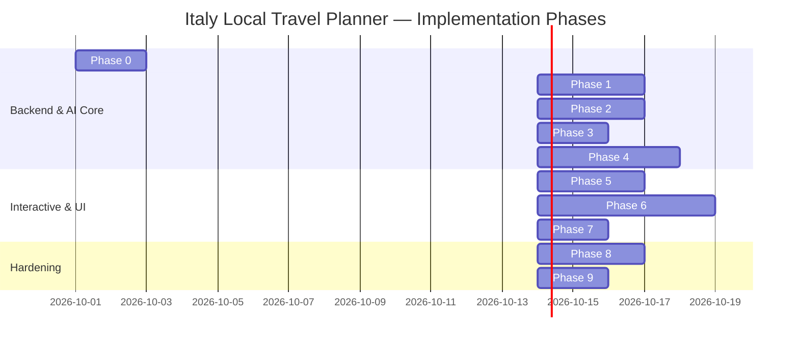

# Italy Local Travel Planner — Phase-Wise Implementation Plan

> **Document Version:** 1.0.0  
> **Status:** Ready for Execution  
> **Architecture Reference:** [architecture.md](architecture.md)  
> **Product Requirements:** [problemstatement.md](problemstatement.md)  

---

## 1. Implementation Roadmap Overview

The development of the **Italy Local Travel Planner** is organized into **9 structured phases**, moving systematically from foundation and domain data models to agentic orchestration, geospatial integration, UI/UX implementation, and production hardening.



---

## Phase 0: Project Foundation, Tooling & Environment Initialization

### 0.1 Objectives
Set up a unified Next.js 15 (App Router) project with React 19, TypeScript, Tailwind CSS, LangChain packages, Google GenAI SDK, and Google Maps dependencies.

### 0.2 Detailed Tasks
1. **Initialize Next.js 15 App:**
   ```bash
   npx create-next-app@latest italy-travel-planner --typescript --tailwind --eslint --app --src-dir --import-alias "@/*"
   ```
2. **Install Core Dependencies:**
   * **AI & Agent Orchestration:** `langchain`, `@langchain/core`, `@langchain/community`, `@langchain/google-genai`, `@langchain/langgraph`, `@google/genai`
   * **Maps & Geospatial:** `@googlemaps/js-api-loader`, `@types/google.maps`
   * **UI & Styling:** `lucide-react`, `framer-motion`, `clsx`, `tailwind-merge`, `shadcn/ui` primitives
   * **State & Data Validation:** `zustand`, `zod`
3. **Configure Environment Variables (`.env.local`):**
   * `GOOGLE_GENAI_API_KEY`: API Key for Gemini 1.5 Pro & 2.0 Flash
   * `NEXT_PUBLIC_GOOGLE_MAPS_API_KEY`: Client-side Maps JavaScript API key
   * `GOOGLE_MAPS_SERVER_API_KEY`: Server-side Places/Routes API key
   * `TAVILY_API_KEY`: Search verification API key
   * `LANGCHAIN_API_KEY` & `LANGCHAIN_PROJECT`: Tracing and observability
4. **Establish Directory Hierarchy:**
   ```text
   src/
   ├── app/ (Pages & API routes)
   ├── components/ (Navigation, Timeline, Map, Food, Chat, UI)
   ├── lib/ (LangChain, Maps, Database, State)
   └── types/ (TypeScript schemas)
   ```

### 0.3 Deliverables & Verification
* Clean compilation (`npm run build` exits with code 0).
* TypeScript configuration with path aliases (`@/*`).
* Verified API keys test script for Gemini and Google Maps.

---

## Phase 1: Local Knowledge Base & Domain Data Models

### 1.1 Objectives
Create typed TypeScript schemas and seed the initial curated domain knowledge database for the six focus destinations: **Rome, Sorrento, Bari, Puglia, Milan, and Lake Garda**.

### 1.2 Detailed Tasks
1. **Define Core TypeScript Schemas (`src/types/`):**
   * `src/types/trip.ts`: `UserTripPreferences`, `DestinationPOI`, `DailyItinerary`, `ActivityBlock`, `TransitBlock`, `RestaurantBlock`, `ReservationChecklist`.
   * `src/types/restaurant.ts`: `Restaurant`, `DietaryClassification`, `SignatureDish`.
2. **Implement Structured Italy Knowledge Repository (`src/lib/db/italyKnowledge.ts`):**
   * **Rome (Lazio):** Colosseum, Vatican Museums, Roman Forum, Pantheon, Trevi Fountain, Galleria Borghese, Trastevere; Signature dishes: *Cacio e Pepe (🥗), Carbonara (🍖), Supplì (⚠️), Maritozzo (🥗)*.
   * **Sorrento (Campania):** Marina Grande, Historic Centre, Bagni Regina Giovanna; Day trips: *Pompeii, Capri, Positano*; Signature dishes: *Gnocchi alla Sorrentina (🥗), Spaghetti Nerano (🥗), Delizia al Limone (🥗)*.
   * **Bari (Puglia):** Bari Vecchia, Basilica San Nicola, Lungomare; Signature dishes: *Focaccia Barese (🥗), Orecchiette con Cime di Rapa (⚠️), Burrata (🥗), Taralli (🥗)*.
   * **Puglia Region:** Polignano a Mare, Monopoli, Alberobello, Ostuni, Lecce, Matera; Hub-and-spoke routes.
   * **Milan (Lombardy):** Duomo, Galleria Vittorio Emanuele II, Last Supper, Brera, Navigli; Signature dishes: *Risotto Milanese (⚠️), Cotoletta (🍖), Panettone (🥗)*.
   * **Lake Garda:** Sirmione, Malcesine, Riva del Garda, Limone sul Garda, ferry lake-hopping routes.
3. **Build Strict Dietary Classification Engine:**
   * Implement four-tier dietary validation: `vegetarian_focused`, `vegetarian_friendly`, `limited_vegetarian`, `not_suitable`.

### 1.3 Deliverables & Verification
* Complete database module `italyKnowledge.ts` with $>60$ curated POIs, $>40$ verified authentic trattorias, and 22 regional signature dishes.
* Unit tests verifying that traditional meat-broth dishes (e.g. authentic Risotto alla Milanese) and anchovy-based dishes (e.g. traditional Orecchiette con Cime di Rapa) are flagged with `⚠️ Depends on preparation`.

---

## Phase 2: Google Maps MCP & Geospatial Ground Truth Engine

### 2.1 Objectives
Build server-side integration with Google Maps Platform (Places API, Routes API, Distance Matrix API) and Google Maps MCP tools to provide deterministic geospatial calculations.

### 2.2 Detailed Tasks
1. **Develop Google Maps Client Wrapper (`src/lib/maps/client.ts`):**
   * Implement Places Details lookup (`fetchPlaceDetails(placeId)`).
   * Implement Multi-Modal Routing (`getRoute(origin, destination, mode)`).
   * Implement Pairwise Distance Matrix (`getDistanceMatrix(origins, destinations, mode)`).
2. **Build LangChain MCP / Custom Tool Adapters (`src/lib/langchain/tools/mapsTools.ts`):**
   * `GoogleMapsPlacesTool`: Queries place IDs, operating hours, coordinates, and user ratings.
   * `GoogleMapsDirectionsTool`: Calculates walking, metro, train, bus, ferry, and driving durations.
   * `GoogleMapsDistanceMatrixTool`: Generates transit cost matrices for itinerary route optimization.
3. **Implement Deep-Link Navigation Generator:**
   * Standardize URL schema: `https://www.google.com/maps/dir/?api=1&origin=LAT,LNG&destination=LAT,LNG&travelmode=MODE` for one-tap navigation.

### 2.3 Deliverables & Verification
* Server-side route calculator supporting all 6 modes: walking, metro, bus, train, ferry, and driving.
* Integration test computing real-world transit time between Sorrento Marina Piccola and Capri port via high-speed ferry (~25 min).

---

## Phase 3: Web Search Grounding & Live Verification Layer

### 3.1 Objectives
Implement dynamic verification using web search tools to retrieve verified booking URLs, operating hours, seasonal closures, and ticket requirements.

### 3.2 Detailed Tasks
1. **Implement Web Search Grounding Tool (`src/lib/langchain/tools/searchTool.ts`):**
   * Integrate Tavily / Serper / Gemini Google Search Grounding to verify official ticket booking availability.
2. **Implement Official Booking Hierarchy Filter:**
   * Rule-based scoring prioritizing:
     1. Official cultural/monument authorities (`museivaticani.va`, `parcocolosseo.it`, `cenacolovinciano.org`)
     2. Official city/regional tourism portals (`turismoroma.it`, `viaggiareinpuglia.it`)
     3. Authorized primary ticketing partners (CoopCulture, VivaTicket, TicketOne)
     4. ❌ Filtering out generic affiliate reseller blogs.
3. **Build Urgency Badge Classifier:**
   * Categorizes attractions into:
     * 🔴 **Needs Booking:** Mandatory advance reservation (Vatican, Colosseum, Last Supper, summer ferries).
     * 🟡 **Booking Recommended:** High-demand sights where advance tickets skip 1-2h queues.
     * 🟢 **No Booking Required:** Walk-in entry (Piazzas, viewpoints, open churches).
4. **Anti-Hallucination Fallback Rule:**
   * If live hours or ticket availability cannot be verified via search, return explicit fallback: *"Information could not be verified right now."*

### 3.3 Deliverables & Verification
* Search tool correctly fetching official booking URLs for Colosseum and Vatican Museums.
* Zero generation of fake, dead, or commercial affiliate links.

---

## Phase 4: LangChain & LangGraph Core Agentic Pipeline

### 4.1 Objectives
Assemble the end-to-end trip planning workflow as a stateful **LangGraph StateGraph**, orchestrating Gemini 1.5 Pro / 2.0 Flash, Google Maps tools, and output parsers.

### 4.2 Detailed Tasks
1. **Construct LangGraph State Machine (`src/lib/langchain/graph.ts`):**
   * Connect all 10 nodes: `parse_preferences_node` $
ightarrow$ `discover_destinations_node` $
ightarrow$ `fetch_maps_data_node` $
ightarrow$ `verify_live_info_node` $
ightarrow$ `rank_recommendations_node` $
ightarrow$ `cluster_routes_node` $
ightarrow$ `generate_itinerary_node` $
ightarrow$ `integrate_dining_node` $
ightarrow$ `detect_overload_node` $
ightarrow$ `generate_checklist_node`.
2. **Implement 12-Factor Scoring & Ranking Chain (`src/lib/langchain/chains/recommendationChain.ts`):**
   * Implement mathematical weighting formula with Gemini generating concise 1-2 sentence recommendation justifications.
3. **Implement Geographic Clustering & Anti-Backtracking Engine:**
   * Group POIs by neighborhood clusters (e.g. Ancient Rome vs. Vatican & Borgo vs. Trastevere).
   * Solve Traveling Salesperson Problem (TSP) ordering using Distance Matrix transit times.
4. **Implement Day Load Pacing & Overload Engine:**
   * Calculate $\text{Total Day} = \text{Activities} + \text{Transit} + \text{Meals} + \text{Buffers}$.
   * Tag days with 🟢 `Comfortable`, 🟡 `Busy`, or 🔴 `Overloaded` badges.
   * Auto-rebalance overloaded days by shifting optional stops or replacing long walks with transit.
5. **Implement Structured JSON Output Parsers:**
   * Enforce Zod / Pydantic schemas on Gemini responses to guarantee typed JSON delivery.

### 4.3 Deliverables & Verification
* Automated end-to-end execution of a 3-day Sorrento plan returning complete structured JSON in under 5 seconds.
* Pacing engine successfully detecting overloaded schedules ($>10.5\text{ hrs}$) and rebalancing them.

---

## Phase 5: Conversational AI Mutation Layer & Memory

### 5.1 Objectives
Build an interactive conversational agent powered by LangChain and LangGraph checkpointers, enabling travelers to modify active itineraries via natural language commands.

### 5.2 Detailed Tasks
1. **Implement Conversational Agent with Memory (`src/lib/langchain/agent.ts`):**
   * Integrate LangGraph `MemorySaver` / Redis state persistence for thread-safe conversation memory.
   * Bind tool calling for itinerary mutations.
2. **Implement Itinerary State Mutation Handlers:**
   * *"Make Day 2 less tiring"* $\rightarrow$ Drops lowest-ranked POI, inserts 45-min cafe pause, replaces long walking legs with metro/taxi.
   * *"Replace this restaurant with a vegetarian restaurant"* $\rightarrow$ Queries top-rated authentic vegetarian trattorias within 500m of preceding POI.
   * *"I don’t want museums"* $\rightarrow$ Swaps indoor galleries for scenic viewpoints and historic piazzas.
   * *"Can I fit Capri into Day 3 from Sorrento?"* $\rightarrow$ Injects full-day Capri/Anacapri sub-itinerary with verified ferry times.
   * *"Swap Day 1 and Day 3"* $\rightarrow$ Reorders daily schedules while maintaining opening hours validity.
3. **Build Mutation Preview & Rollback System:**
   * Return diff previews before committing major multi-day structural alterations.

### 5.3 Deliverables & Verification
* Interactive chat drawer mutating the client-side Zustand store seamlessly on user prompts.
* Conversation test verifying that preferences (e.g. "remember I am vegetarian") persist across multi-turn prompts.

---

## Phase 6: Frontend UI/UX Implementation & Screen-by-Screen Engineering

### 6.1 Objectives
Construct a minimal, responsive, Italian-inspired UI system (warm terracotta, olive green, Mediterranean azure, clean slate) featuring persistent 5-tab bottom navigation and mobile-first touch optimization.

### 6.2 Detailed Tasks
1. **Build Persistent Navigation System (`src/components/navigation/`):**
   * `BottomNav.tsx`: 5 persistent tabs `[ 🧭 Explore ] [ 🗺️ Plan ] [ 📍 Map ] [ 🍝 Food ] [ 🎒 My Trip ]`.
   * `Header.tsx`: Active city title, day switcher, and AI assistant toggle button.
2. **Develop Screen 1 — Home Screen (`src/app/page.tsx`):**
   * Hero header: *"Where are you going in Italy?"*
   * Interactive Destination Cards with photography & badges: 🇮🇹 Rome, 🌊 Sorrento, 🌊 Bari, 🌿 Puglia, 🏙 Milan, 🏔 Lake Garda.
   * Quick action buttons: `[ ⚡ Plan My Trip ]` and `[ 📍 Explore Nearby ]`.
3. **Develop Screen 2 — Explore Destination (`src/app/explore/[city]/page.tsx`):**
   * Multi-select Category Chips: *Historical, Museums, Beaches, Shopping, Food, Viewpoints, Nature, Churches, Culture, Photo Spots, Nightlife, Must Visit*.
   * AI-Ranked Destination Cards with dwell time badges, crowd tips, and booking status.
4. **Develop Screen 3 — Itinerary & Route Timeline (`src/app/itinerary/[tripId]/page.tsx`):**
   * Day Tabs with Day Efficiency Indicators (`🟢 Comfortable`, `🟡 Busy`, `🔴 Overloaded`).
   * Vertical Timeline Nodes: Step-by-step activity cards, transit pills (e.g., `🚶 Walk 8 min (550m)` or `🚆 Train 30 min`), dining blocks, and one-tap `Navigate in Google Maps` buttons.
5. **Develop Screen 4 — Interactive Map (`src/app/map/page.tsx`):**
   * Google Maps JavaScript API integration with custom stylized pins and sequential route polylines.
   * Category filter toggles: *All, Attractions, Food, Shopping, Hotels*.
   * Tap-to-inspect Compact Bottom Sheet with quick directions link.
6. **Develop Screen 5 — Food & Regional Signature Hub (`src/app/food/[city]/page.tsx`):**
   * Dietary filter bar: *Vegetarian, Non-Vegetarian, Both*.
   * *"What should I eat here?"* regional signature dish interactive carousel.
   * Verified restaurant cards with signature dish badges and direct reservation links.
7. **Develop Screen 6 — Reservation Checklist & Trip Overview (`src/app/checklist/[tripId]/page.tsx`):**
   * Multi-city summary cards with dates and stay counts.
   * Urgency-categorized interactive checklist: 🔴 Needs booking, 🟡 Booking recommended, 🟢 No booking required.
8. **Develop Conversational AI Drawer (`src/components/chat/ConversationalDrawer.tsx`):**
   * Slide-over AI chat drawer with streaming responses and instant itinerary mutation cards.

### 6.3 Deliverables & Verification
* Fluid, fully responsive UI across Mobile, Tablet, and Desktop viewports.
* Smooth Framer Motion transitions between tabs, timeline nodes, and bottom sheets.

---

## Phase 7: State Management & Offline Persistence

### 7.1 Objectives
Implement client-side state synchronization using Zustand with LocalStorage persistence, ensuring travelers can access saved itineraries, checklists, and route navigation offline.

### 7.2 Detailed Tasks
1. **Implement Zustand Global Store (`src/lib/state/useTripStore.ts`):**
   * Actions for updating preferences, active day tabs, selected POIs, chat state, and mutated itineraries.
   * Zustand middleware (`persist`) storing active trip data in `localStorage`.
2. **Offline Fallback Caching:**
   * Cache rendered map bounds, timeline nodes, and checklist checkboxes so itineraries function without active cell reception in Italian historic centers.
3. **Export & Share Utilities:**
   * Generate downloadable PDF / ICS calendar export for itinerary blocks.
   * Generate shareable itinerary URL link.

### 7.3 Deliverables & Verification
* Full itinerary and checklist accessibility when browser is toggled to Offline Mode in Chrome DevTools.
* Seamless synchronization between Zustand store, chat mutations, and timeline UI components.

---

## Phase 8: Anti-Hallucination Verification, Latency Optimization & QA

### 8.1 Objectives
Perform rigorous testing of all 10 AI Rules, benchmark end-to-end response latency ($<5\text{ seconds}$), and eliminate edge-case errors.

### 8.2 Detailed Tasks
1. **Automated AI Rule Enforcement Tests:**
   * **Rule 1 (Zero Fabrication):** Verify all POIs and restaurants match ground-truth Google Maps Places IDs.
   * **Rule 2 (Ground-Truth Routing):** Verify all transit times match Maps Routes calculations.
   * **Rule 3 & 4 (Official Booking Links):** Verify all booking links point to official domain authorities (`.va`, `.it`, authorized partners) and no broken reseller links exist.
   * **Rule 5 (No Overload):** Verify days never exceed $10.5\text{ hours}$ without active warnings.
   * **Rule 6 (Geographical Clustering):** Verify zero cross-city backtracking within the same half-day.
   * **Rule 7 (Mandatory Buffers):** Verify every transit leg includes walking, queue, and dwell buffers.
   * **Rule 8 (Dietary Fidelity):** Verify zero meat dishes or meat broths tagged as vegetarian.
   * **Rule 9 & 10 (Transparency & Explicit Uncertainty):** Verify unverified hours/tickets trigger fallback disclaimers.
2. **Performance & Latency Optimization:**
   * Implement parallel tool execution (`Promise.all`) for Google Maps Places, Routes, and Search verification.
   * Implement Redis / Local memory caching for repeated POI lookups and transit matrices.
   * Benchmark response latency to achieve $<5\text{ seconds}$ for full 3-day itinerary synthesis.
3. **Cross-Platform Mobile Testing:**
   * Verify touch gestures, bottom navigation, map pin taps, and bottom sheet dragging on iOS Safari and Android Chrome.

### 8.3 Deliverables & Verification
* Test suite with $>90\%$ test pass rate across all 10 AI direct rules.
* Measured end-to-end latency $\le 4.5\text{ seconds}$ on standard broadband connection.

---

## Phase 9: Deployment, Production Launch & Maintenance

### 9.1 Objectives
Deploy the application to a high-availability production cloud environment (Vercel / Google Cloud Run) with monitoring, observability, and caching.

### 9.2 Detailed Tasks
1. **Production Build & CI/CD Pipeline:**
   * Configure GitHub Actions workflow running linting, type-checking, and unit tests on pull requests.
   * Deploy Next.js 15 application to Vercel with edge-ready API routes.
2. **Configure LangSmith Observability:**
   * Enable `LANGCHAIN_TRACING_V2` in production to monitor chain execution latency, token consumption, and agent tool invocation frequency.
3. **Set Up Google Maps Quota & Budget Alerts:**
   * Configure Google Cloud Console billing alerts and API rate limiters.
4. **Final Acceptance & Smoke Testing:**
   * Execute live user journey test for all 6 core destinations (Rome, Sorrento, Bari, Puglia, Milan, Lake Garda).

---

## 10. Implementation Phase Checklist & Definition of Done

| Phase | Core Objective | Key Deliverables | Status |
| :---: | :--- | :--- | :---: |
| **Phase 0** | Project Setup & Tooling | Next.js 15, TypeScript, Tailwind, LangChain, Maps SDK initialized | ⬜ |
| **Phase 1** | Local Knowledge Base | Schemas & initial 6-region Italian domain database seeded | ⬜ |
| **Phase 2** | Maps MCP Integration | Multi-modal routes, Places details, Distance Matrix, deep links | ⬜ |
| **Phase 3** | Web Search Verification | Live booking link verification, urgency badges (🔴🟡🟢), fallback | ⬜ |
| **Phase 4** | LangChain StateGraph | 10-node agentic workflow, 12-factor scoring, pacing, TSP clustering | ⬜ |
| **Phase 5** | Conversational Mutations | Chat drawer with LangGraph checkpointers, direct state mutations | ⬜ |
| **Phase 6** | UI/UX & 5-Screen System | Responsive screens (Home, Explore, Timeline, Map, Food, Checklist) | ⬜ |
| **Phase 7** | State & Offline Persistence| Zustand store, localStorage caching, offline itinerary viewer | ⬜ |
| **Phase 8** | QA & Latency Optimization | 10 AI rules validation, $<5\text{s}$ latency benchmark, mobile testing | ⬜ |
| **Phase 9** | Production Deployment | Vercel / Cloud Run launch, LangSmith tracing, live smoke tests | ⬜ |

---

### Master Project Success Target
A user submits:  
> *"I’m in Sorrento for 3 days, vegetarian, I like beaches, history, shopping and scenic places."*  

Within **under 5 seconds**, the system synthesizes a complete, geographically clustered, physically realistic 3-day itinerary with exact travel times, verified vegetarian trattorias, local crowd tips, official booking links, and one-tap Google Maps navigation—requiring zero manual research across external blogs.
