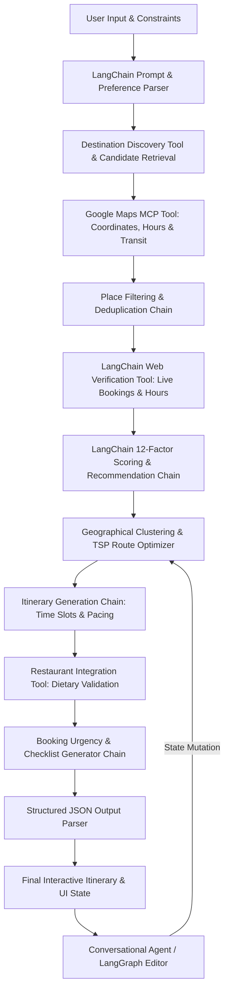

# Italy Local Travel Planner — Expert
> **Product Requirements & Technical Specification Document**


---

## 1. Product Vision

Build a clean, intelligent, AI-powered Italy travel planner that helps travellers plan trips around Italy as if they had a knowledgeable local with them.

The application should combine:
* **LangChain Orchestration Framework:** Core agentic runtime, LCEL chains, and tool coordination for multi-step reasoning, memory, and structured outputs.
* **Google AI Studio / Gemini Models:** Integrated via LangChain (`ChatGoogleGenerativeAI`) for contextual itinerary generation and semantic reasoning.
* **Google Maps / Google Maps MCP Tools:** Integrated as LangChain Tools for locations, routes, travel times, and multi-modal transit calculations.
* **Web Search Verification Tools:** Live search grounding (Tavily/Serper/Google Search) wrapped as LangChain Tools for booking links and real-time hours.
* **Restaurant Discovery & Dietary Engine:** Rigorous vegetarian vs. non-vegetarian classification and authentic regional dish matching.
* **Day-by-Day Itinerary Planning:** Geographically clustered, paced schedules with zero backtracking.
* **Realistic Travel-Time Calculations:** Exact transit calculations including boarding, queues, and walking fatigue.
* **Local Tips & Practical Guidance:** Concise, high-value insider advice on avoiding crowds, tourist traps, and logistical mistakes.

The application should initially focus on:
Rome · Sorrento · Bari · Puglia · Milan · Lake Garda

> [!IMPORTANT]
> **The core philosophy is:**
Don’t just show tourists what exists. Tell them what is actually worth doing, how to get there, how long it will take, what to eat, what needs booking, and how to experience the destination like a local.


---

## 2. Core Problem

Traditional travel-planning applications have several problems:


### Problem 1 — Too much information

Tourists searching for a destination are presented with hundreds of:
* attractions
* museums
* beaches
* restaurants
* historical sites
* shopping areas
* viewpoints
* activities
The traveller then has to manually determine what is actually worth visiting.
The app should instead filter the destination intelligently.


### Problem 2 — Generic itineraries

Most itinerary generators produce unrealistic plans such as:
9:00 Colosseum
10:30 Vatican
12:00 Trevi Fountain
13:00 Restaurant
14:00 Pantheon
15:00 Spanish Steps

This ignores:
* walking time
* queues
* transport
* opening hours
* attraction duration
* geographical clustering
* meal times
* fatigue
* booking requirements
The app must generate physically realistic itineraries.


### Problem 3 — Tourists don’t understand geography

A traveller may know:
“I want to visit the Amalfi Coast.”
But may not understand:
* where each location is
* how far it is
* whether it is better by car, train, ferry or bus
* how long transfers take
* whether locations can realistically be combined
* which places are close enough to visit together
The application should turn the map into a travel-planning engine, rather than merely displaying pins.


### Problem 4 — Missing local context

Tourists need practical information such as:
* best time to visit
* how to get there
* where to enter
* which station to use
* whether reservations are required
* whether the attraction is worth visiting at night
* where locals typically eat
* what food to try
* tourist traps to avoid
* how much time to allocate
* what neighbourhood to explore
The AI should provide this context without overwhelming the user.


---

## 3. Target User

The primary user is a traveller visiting Italy who wants:
Maximum experience with minimum planning effort.

The user should be able to enter:
* destination
* number of days
* interests
* food preferences
* starting location
* transportation preferences
* approximate daily availability
and receive a complete, geographically optimized itinerary.


---

## 4. Main App Flow

The application should have four primary functions.


### A. Explore a Destination

User selects:
Rome

The app displays categories such as:
* 🏛 Historical
* 🖼 Museums
* 🏖 Beaches
* 🛍 Shopping
* 🍝 Food
* 🌅 Viewpoints
* 🌳 Nature
* ⛪ Churches
* 🎭 Culture
* 📸 Instagram/photo spots
* 🌙 Nightlife
* ⭐ Must Visit
The user can select multiple categories.


### B. Build My Trip

User enters:
Destination: Rome
Duration: 4 days
Starting location: Hotel / current location
Interests: Historical + Shopping + Food + Viewpoints
Walking tolerance: Moderate
Transport: Public transport + walking
AI then generates an itinerary.


### C. Explore Nearby

The user can provide a location.
Example:
“I’m staying near Sorrento.”

The application should identify:
* nearby attractions
* beaches
* viewpoints
* towns
* restaurants
* shopping
* historical sites
* day trips

Then rank them based on:
distance + popularity + relevance + user’s interests + available time

If a destination is sufficiently worthwhile, AI can recommend travelling farther.
Example:
“Pompeii is 35 minutes away and is highly relevant to your historical-interest profile, so it is worth making the trip.”


### D. Restaurants & Food

The restaurant section should allow:
Food preference:
* Vegetarian
* Non-vegetarian
* Both

Optional filters:
* Breakfast
* Lunch
* Dinner
* Cafe
* Fine dining
* Local/traditional
* Cheap eats
* Romantic
* Family
* Quick meal
* Michelin / premium

For every recommended restaurant, show:
* restaurant name
* location
* distance
* approximate travel time
* cuisine
* price level
* signature dishes
* vegetarian/non-vegetarian suitability
* recommended dishes
* opening hours when available
* booking requirement
* direct booking link when available
* Google Maps navigation option


---

## 5. Destination Discovery Engine

When a user selects a city or region, AI should construct a structured destination database.
For example:
Rome

Must Visit:
* Colosseum
* Roman Forum
* Trevi Fountain
* Pantheon
* Vatican Museums
* St. Peter’s Basilica
* Piazza Navona
* Spanish Steps

Historical:
* Colosseum
* Roman Forum
* Pantheon
* Castel Sant’Angelo

Shopping:
* Via del Corso
* Via Condotti
* local markets
* neighbourhood shopping streets

Food:
* Roman trattorias
* pizza
* pasta
* gelato
* local markets

The system should not simply dump a list.
Each destination should contain structured metadata:

```text
Destination
├── Name
├── Category
├── Coordinates
├── Popularity
├── Tourist importance
├── Recommended duration
├── Opening hours
├── Booking required?
├── Booking URL
├── Estimated cost
├── Best visiting time
├── Nearby destinations
├── Transportation options
├── Local tips
├── Signature experiences
└── User relevance score
```


---

## 6. AI Recommendation System

The AI should determine what is relevant to the user.
For example:
User selects: Historical + Beach + Food

The AI shouldn’t return every attraction.
It should prioritize places based on:
Recommendation factors:
1. User interests
2. Destination popularity
3. Tourist significance
4. Local relevance
5. Distance
6. Time required
7. Opening hours
8. Current availability
9. Season
10. Weather where relevant
11. Booking requirements
12. Compatibility with other destinations

The system should explain recommendations briefly.
Example:
Pompeii — Highly Recommended
A major archaeological site near Sorrento and one of the most significant historical experiences in the region. Allow approximately 3–4 hours including travel.


---

## 7. Intelligent Itinerary Generation

The most important functionality is automatic itinerary optimization.
The AI should not simply order attractions randomly.
It should optimize for:

Geography:
Group nearby attractions together.

Travel time:
Avoid unnecessary backtracking.

Opening hours:
Do not schedule attractions when closed.

Booking times:
Respect existing reservation times.

Duration:
Account for realistic time spent at each attraction.

Transportation:
Use Google Maps data to determine:
* walking
* train
* metro
* bus
* ferry
* taxi
* car

Human limitations:
Don’t schedule 12 major attractions in one day.
Include:
* meals
* breaks
* realistic walking
* free time


---

## 8. Google Maps Integration

Google Maps should be deeply integrated into the experience.
The application should use Google Maps / Google Maps MCP for:

Location:
* coordinates
* addresses
* nearby places

Routing:
Calculate:
`Hotel → Attraction → Restaurant → Attraction → Hotel`

Travel modes:
* walking
* driving
* public transportation
* cycling where available

Travel time:
Example:
`Sorrento → Pompeii`
🚆 Train — approximately X minutes

Navigation:
Each itinerary item should have:
Navigate → Google Maps


---

## 9. Google Maps MCP Logic

When generating an itinerary, the AI should use map data rather than guessing travel times.
Example:
START
↓
Hotel
↓
Attraction A
↓
Attraction B
↓
Lunch
↓
Attraction C
↓
Dinner
↓
Hotel

For every transition:
Origin
Destination
Distance
Travel time
Transport options
Recommended transport

The system should then calculate the total daily travel time.
Example:
Daily travel: 1h 15m
Walking: 4.2 km
Activities: 7h 30m
Meals: 2h
Total planned day: ~10h 45m

This allows the AI to detect an overloaded day.


---

## 10. “Travel Like a Local” Mode

This should be a major differentiator.
For every destination, provide a small:
Local Tips

Example:
Local tip: Visit early morning before the main tourist crowds arrive.
Getting there: The train is generally more convenient than driving because parking near the attraction can be difficult.
Food tip: Try the regional specialty rather than choosing an international chain nearby.
Time tip: Sunset is particularly useful for this viewpoint.

The information should be short and actionable, not a long travel essay.


---

## 11. Restaurant Intelligence

Restaurants should be integrated directly into the itinerary.
For example:
Day 2
12:45 — Lunch
AI automatically searches restaurants near the previous attraction.

The system considers:
* cuisine
* vegetarian/non-vegetarian preference
* rating
* distance
* opening hours
* price
* local reputation
* signature dishes

Example:
🍝 Lunch Recommendation
Traditional Roman restaurant
📍 7 min walk
🥗 Vegetarian options available
⭐ Highly reviewed
Try: Cacio e pepe
Vegetarian: Yes
[View on Maps] [Book Table]


---

## 12. Vegetarian / Non-Vegetarian System

The user should select:
🥗 Vegetarian
The recommendation engine should prioritize:
* vegetarian restaurants
* restaurants with strong vegetarian menus
* traditional vegetarian-compatible Italian dishes

🍖 Non-Vegetarian
Prioritize restaurants based on:
* meat
* seafood
* regional specialties

🥗🍖 Both
Provide mixed recommendations.

> [!WARNING]
> **Important:**
The system should not assume that a restaurant is vegetarian-friendly solely because it has one vegetarian dish.
It should distinguish:
Vegetarian-friendly
Vegetarian-focused
Limited vegetarian options
Not suitable


---

## 13. Signature Dish Engine

Every destination should have a:
“What should I eat here?” section.

For example:
Rome:
* Carbonara
* Cacio e pepe
* Amatriciana
* Supplì
* Maritozzo
* Gelato

Bari / Puglia:
* Orecchiette
* Focaccia Barese
* Panzerotti
* Burrata
* Taralli

The app should indicate whether each dish is:
🥗 Vegetarian
🍖 Non-vegetarian
⚠️ Depends on preparation

This is particularly important for vegetarian travellers.


---

## 14. Booking Intelligence

For attractions that require or strongly benefit from reservations, the application should automatically search the web for current booking information.

Examples:
* Vatican Museums
* Colosseum
* popular restaurants
* boat tours
* guided tours
* attractions with timed entry

The interface should display:
🎟 Booking Recommended
and provide:
Book Officially →

The system should prioritize:
1. Official booking website
2. Official tourism authority
3. Reputable booking provider

Avoid presenting random affiliate sites as the primary booking option.


---

## 15. Dynamic Information

Because travel information changes, the application should distinguish between:

Static AI knowledge:
General destination information.

and:

Live information:
Retrieved when required:
* opening hours
* temporary closures
* ticket availability
* booking links
* restaurant information
* transport information
* current travel conditions

The AI should not fabricate live information.
If live information cannot be verified, clearly state:
“Information could not be verified right now.”


---

## 16. City + Region Logic

The application must understand that some destinations are cities, while others are regions/areas.

For example:
Puglia
The user shouldn’t receive “Puglia” as one location.
Instead, the application should discover relevant locations such as:
* Bari
* Alberobello
* Polignano a Mare
* Ostuni
* Monopoli
* Lecce
* Matera if relevant to the user’s route

Similarly:
Lake Garda
The system should understand the lake as a geographical area containing multiple destinations.
The AI should recommend locations based on:
* user’s base
* transportation
* available days
* distance


---

## 17. Day Trip Intelligence

If the user has enough time, the system should suggest day trips.

Example:
You’re staying in Sorrento for 3 days.
Possible recommendations:
Pompeii
Capri
Positano
Amalfi
Naples

The AI should calculate whether each is practical.

Example:
Capri — Day Trip
Travel required: approximately X
Recommended time: Full day
Best transport: Ferry
Recommendation reason: High relevance to your selected interests.


---

## 18. Smart “Worth the Trip?” Feature

This would be an excellent feature.
If the user is in Bari and asks:
“What should I visit nearby?”

The AI should calculate:
Distance + Travel time + Destination importance + User interests + Time available

Then say:
Worth the trip: Polignano a Mare
Approx. travel time: X
Suggested visit duration: X
Why: coastal scenery + old town + food

This prevents the user from wasting time travelling somewhere that doesn’t fit their itinerary.


---

## 19. Interface / UX Requirements

The application should be minimal and premium, not information-heavy.

Avoid:
❌ Huge lists
❌ Too many buttons
❌ Dense cards
❌ Excessive text
❌ Overloaded maps
❌ Too many filters visible simultaneously

Use:
Bottom navigation:
Explore | Plan | Map | Food | Trip


---

## 20. Home Screen

The home screen should immediately ask:
Where are you going?

Cards:
🇮🇹 Rome
🌊 Sorrento
🌊 Bari
🌿 Puglia
🏙 Milan
🏔 Lake Garda

Then:
“Plan My Trip”
and
“Explore Nearby”


---

## 21. Explore Screen

Example:
ROME
What are you interested in?

Selectable chips:
Must Visit
Historical
Museums
Shopping
Food
Nightlife
Viewpoints
Hidden Gems

After selection:
AI Recommended
Show only the most relevant destinations first.


---

## 22. Map Screen

The map should visually display:
* attractions
* restaurants
* itinerary route
* hotels
* stations
* beaches
* points of interest

However, do not display hundreds of pins simultaneously.
Use category filtering.
Example:
All | Attractions | Food | Shopping | Hotels

Selecting a place should open a compact bottom sheet.


---

## 23. Itinerary Screen

Example:
Day 2 — Ancient Rome

09:00
🏛 Colosseum
2h 30m
↓
🚶 8 min
11:40
🏛 Roman Forum
1h 30m
↓
🚶 12 min
13:30
🍝 Lunch
Local Roman restaurant
↓
🚶 10 min
15:00
⛪ Pantheon
45 min
↓
16:00
🌆 Piazza Navona
1h

At the top:
Day efficiency
🟢 Comfortable
or
🟡 Busy
or
🔴 Overloaded


---

## 24. Route Intelligence

Every itinerary transition should show:
Next destination
🚶 Walk — 12 min
or
🚇 Metro — 18 min
or
⛴ Ferry — 35 min

The user can tap:
View Route
which opens Google Maps navigation.


---

## 25. Trip Editing

The user must be able to easily:
* remove a destination
* add a destination
* move an attraction
* change restaurant
* change transportation
* swap days
* regenerate a day
* regenerate the entire itinerary

Example:
“Make Day 2 less tiring.”
AI should automatically restructure that day.


---

## 26. AI Conversation Layer (LangChain Conversational Agent)

Include an interactive AI conversational assistant powered by a **LangChain Conversational Agent / LangGraph**:

The user can ask natural language requests:
* *“Is Capri worth doing from Sorrento?”*
* *“Give me more beaches.”*
* *“Replace this restaurant with a vegetarian restaurant.”*
* *“I don’t want museums.”*
* *“Make tomorrow more relaxed.”*
* *“Can I fit Polignano a Mare into this day?”*
* *“What’s the easiest way to reach this place?”*

> [!IMPORTANT]
> **State Mutation Mandate:** The LangChain Agent must directly mutate the itinerary state schema rather than merely answering conversationally. It executes tool calls to swap POIs, recalculate transit times via Google Maps MCP, and return updated structured itinerary objects.


---

## 27. Personal Preference Memory (LangChain Memory & State Store)

The app integrates **LangChain Memory & Persistence** (e.g. `ChatMessageHistory` / SQLite or Redis state store) to remember user trip preferences across sessions:
* Dietary constraints (Vegetarian / Non-Vegetarian / Vegan)
* Preferred transport modes (Public transit, walking, driving, ferry)
* Walking tolerance thresholds
* Preferred attraction categories (Art, history, nature, food)
* Budget tier (€ to €€€€)
* Preferred restaurant and dining styles

This allows increasingly personalized recommendations and continuous context retention during conversational editing.


---

## 28. Trip Overview

Before the trip, show:
🇮🇹 Italy Trip
Rome — 4 days
Sorrento — 3 days
Bari — 2 days
Puglia — 3 days
Milan — 2 days
Lake Garda — 2 days

Include:
* dates
* cities
* accommodation
* transportation
* major attractions
* reservations
* restaurants
* saved places


---

## 29. Reservation Checklist

Automatically generate:
Before Trip
- [ ] Colosseum ticket
- [ ] Vatican ticket
- [ ] Capri ferry
- [ ] Restaurant reservation
- [ ] Train tickets
- [ ] Hotel
- [ ] Boat tour

The app should highlight:
🔴 Needs booking
🟡 Booking recommended
🟢 No booking required


---

## 30. Technical Architecture

The application is engineered using a modular, agentic architecture powered by **LangChain**:

```
┌────────────────────────────────────────────────────────────────────────┐
│                        SYSTEM ARCHITECTURE                             │
├───────────────────┬────────────────────────────────────────────────────┤
│ Frontend          │ Clean, responsive interface (Desktop, Mobile, Tab) │
│ Agent Framework   │ LangChain / LangGraph (LCEL, StateGraph, Tools)    │
│ AI / LLM Model    │ Google Gemini 1.5 Pro / 2.0 Flash via LangChain    │
│ Maps Ground Truth │ Google Maps Platform (Places, Routes) / Maps MCP   │
│ Live Verification │ Web Search Tools (Tavily / Serper / Search Ground) │
└───────────────────┴────────────────────────────────────────────────────┘
```

### Frontend
Clean, responsive interface optimized for:
* Desktop
* Mobile
* Tablet

### LangChain AI Orchestration Layer
LangChain serves as the backbone orchestrating models, tools, memory, and structured outputs:
* **LLM Integration:** `ChatGoogleGenerativeAI` (`langchain-google-genai` / `@langchain/google-genai`) interfacing with Gemini 1.5 Pro & Gemini 2.0 Flash.
* **LangChain Expression Language (LCEL) & LangGraph:** Stateful workflows managing destination retrieval, constraint verification, and multi-day itinerary generation.
* **Structured Output Parsers:** Pydantic (Python) or Zod (TypeScript) schemas ensuring deterministic JSON outputs for `DestinationPOI`, `Restaurant`, `DailyItinerary`, and `ReservationChecklist`.
* **LangChain Toolset & MCP Client:**
  * `GoogleMapsDirectionsTool` & `GoogleMapsPlacesTool` (Maps MCP)
  * `WebSearchVerificationTool` (Live ticket and hours verification)
  * `DietaryFilterTool` (Vegetarian / Non-Vegetarian validator)
  * `TravelPacingTool` (Fatigue and transit overload calculation)
* **LangChain Memory & State Persistence:** `ChatMessageHistory` / LangGraph Checkpointers for contextual multi-turn conversational trip editing and preference memory.

### Maps (Google Maps Platform / MCP)
Integrated as deterministic LangChain Tools for:
* Places & Geocoding
* Maps & Polylines
* Directions & Routes
* Distance Matrix calculations
* Travel time & transit modes (walking, metro, train, bus, ferry, driving)
* Google Maps navigation intent links

### Web Search & Live Verification
Integrated via LangChain Tools for:
* Official booking pages
* Official attraction authority websites
* Real-time opening hours & seasonal schedules
* Current restaurant operational status & reservation portals
* Temporary closures, strikes, and travel advisories


---

## 31. AI Data Flow & LangChain Execution Pipeline



The system follows this LangChain pipeline:
1. **User Input:** Captures destination, duration, interests, diet, and starting point.
2. **Preference Interpretation:** LangChain parser structures user constraints into a typed state object.
3. **Destination Discovery Tool:** Retrieves candidate POIs matching categories.
4. **Google Maps MCP Tool:** Queries ground-truth coordinates, addresses, and place IDs.
5. **Place Filtering & Deduplication:** Prunes tourist traps and closed attractions.
6. **Web Verification Tool:** Verifies live booking URLs and seasonal opening hours.
7. **AI Recommendation Chain:** Computes 12-factor recommendation scores with concise justifications.
8. **Geographical Clustering:** Groups attractions into neighborhood clusters to eliminate backtracking.
9. **Itinerary Generation Chain:** Assigns realistic time slots, dwell durations, and rest buffers.
10. **Restaurant Integration Tool:** Inserts authentic dining stops with verified vegetarian/non-veg compatibility.
11. **Booking Checklist Generator:** Compiles pre-trip ticketing checklist with urgency badges.
12. **Structured Output Parser:** Delivers strictly typed JSON to the frontend UI.


---

## 32. Important AI Rules

The AI must follow these rules:


### Rule 1

Never invent a place, restaurant, booking URL, travel time or opening hour.


### Rule 2

Use Google Maps data for distances and routing rather than estimating manually.


### Rule 3

Use web search when current information is required.


### Rule 4

Prefer official booking sources.


### Rule 5

Don’t overload the itinerary.


### Rule 6

Cluster geographically.


### Rule 7

Always account for travel time.


### Rule 8

Respect the user’s food preferences.


### Rule 9

Clearly distinguish:
AI recommendation
from
verified/current information.


### Rule 10

If information cannot be verified, tell the user rather than hallucinating.


---

## 33. Example User Journey

User opens app.


#### Step 1

Where are you going?
Sorrento


#### Step 2

How many days?
3


#### Step 3

What do you like?
- [x] Beaches
- [x] Historical
- [x] Food
- [x] Scenic views
- [ ] Museums
- [x] Shopping


#### Step 4

Food preference
Vegetarian


#### Step 5

AI generates:
Your Sorrento Plan

Day 1 — Sorrento
`Historic centre → Marina Grande → local food → sunset viewpoint`

Day 2 — Pompeii
`Sorrento → Pompeii → archaeological site → lunch → return`

Day 3 — Capri
`Ferry → Capri → Anacapri → viewpoints → return`

Each activity includes:
time + duration + route + transport + tips + food + booking


---

## 34. The Main Differentiator

> [!NOTE]
> **The app should not be another Google Maps clone.**
Google Maps answers:
“Where is this place?”

This application should answer:
“What should I do, in what order, how do I get there, how long should I stay, where should I eat, what should I book, and is it actually worth my time?”

The map is the infrastructure.
AI is the travel planner.
Web search is the verification layer.
The itinerary is the final product.


---

## 35. Initial Italy Destination Database

The application should initially support:

🇮🇹 Rome
Historical sites, Vatican, museums, food, shopping, nightlife, viewpoints and neighbourhood exploration.

🌊 Sorrento
Sorrento itself + nearby destinations and day trips.

🌊 Bari
Old Town, waterfront, food, beaches, historical attractions and nearby destinations.

🌿 Puglia
Bari, Polignano a Mare, Monopoli, Alberobello, Ostuni, Lecce and other relevant destinations based on the user’s base.

🏙 Milan
Duomo, shopping, fashion, historical attractions, nightlife, food and day trips.

🏔 Lake Garda
Lake towns, viewpoints, beaches, ferries, nature, historical attractions and nearby destinations.


---

## 36. Final Product Requirement

The final application should feel like:
**Google Maps + LangChain AI Agent + Local Italian Guide + Itinerary Optimizer**  
...packaged within an extremely clean, minimal, and responsive user interface.

The user should never feel like they are filling out a complicated travel-planning form.

The ideal experience is:
Choose destination → choose interests → choose days → AI builds trip → user edits → navigate.

The app should prioritize convenience, accuracy, geographical intelligence and local discovery over showing the maximum amount of information.

Core success metric:
A user should be able to enter:
“I’m in Sorrento for 3 days, vegetarian, I like beaches, history, shopping and scenic places.”
and within seconds receive a realistic, geographically optimized 3-day itinerary with transport instructions, restaurants, local tips, booking requirements and Google Maps navigation—without needing to manually research dozens of websites.
